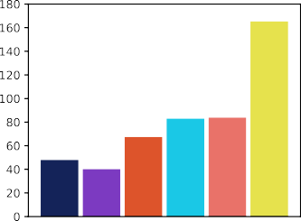

> Linux has become a viable operating system for many real-time
> workloads. However, the black-box approach adopted by cyclictest, the
> tool used to evaluate the main real-time metric of the kernel, the
> scheduling latency, along with the absence of a theoretically-sound
> description of the in-kernel behavior, sheds some doubts about Linux
> meriting the real-time adjective. Aiming at clarifying the PREEMPT\_RT
> Linux scheduling latency, this paper leverages the *Thread
> Synchronization Model* of Linux to derive a set of properties and
> rules defining the Linux kernel behavior from a scheduling
> perspective. These rules are then leveraged to derive a sound bound to
> the scheduling latency, considering all the sources of delays
> occurring in all possible sequences of synchronization events in the
> kernel. This paper also presents a tracing method, efficient in time
> and memory overheads, to observe the kernel events needed to define
> the variables used in the analysis. This results in an easy-to-use
> tool for deriving reliable scheduling latency bounds that can be used
> in practice. Finally, an experimental analysis compares the cyclictest
> and the proposed tool, showing that the proposed method can find sound
> bounds faster with acceptable overheads.
>
> **2012 ACM Subject Classification** Computer systems organization *→*
> Real-time operating systems
>
> **Keywords and phrases** Real-time operating systems, Linux kernel,
> PREEMPT\_RT, Scheduling latency

#  1 Introduction

> Real-time Linux has been a recurring topic in both research
> \[[5](#_bookmark42), [6](#_bookmark43), [30](#_bookmark67)\] and
> industry \[[10](#_bookmark47), [11](#_bookmark48), [12](#_bookmark49),
> [21](#_bookmark58), [39](#_bookmark76)\] for more than a decade.
> Nowadays, Linux has an extensive set of real-time related features,
> from theoretically-supported schedulers such as SCHED\_DEADLINE
> \[[27](#_bookmark63)\] to the priority inversion control in locking
> algorithms and a fully-preemptive mode. Regarding the fully-preemptive
> mode, Linux developers have extensively reworked the Linux kernel to
> reduce the code sections that could delay the scheduling of the
> highest-priority thread, leading to the well-known PREEMPT\_RT
> variant. cyclictest is the primary tool adopted in the evaluation of
> the fully-preemptive mode of PREEMPT\_RT Linux \[[8](#_bookmark45)\],
> and it is used to compute the time difference between the expected
> activation time and the actual start of execution of a high-priority
> thread running on a CPU. By configuring the measurement thread with
> the highest priority and running a background taskset to generate
> disturbance,
>
> cyclictest is used in practice to measure the *scheduling latency* of
> each CPU of the system. Maximum observed latency values generally
> range from a few microseconds on single-CPU systems to 250
> microseconds on non-uniform memory access systems
> \[[35](#_bookmark72)\], which are acceptable values for a vast range
> of applications with sub-millisecond timing precision
>
> requirements. This way, PREEMPT\_RT Linux closely fulfills theoretical
> fully-preemptive system assumptions that consider atomic scheduling
> operations with negligible overheads.
>
> Despite its practical approach and the contributions to the current
> state-of-art of real-time Linux, cyclictest has some known
> limitations. The main one arises from the opaque nature of the latency
> value provided by cyclictest \[[4](#_bookmark41)\]. Indeed, it only
> informs about the latency value, without providing insights on its
> root causes. The tracing features of the kernel are often applied by
> developers to help in the investigation. However, the usage of tracing
> is not enough to resolve the problem: the tracing overhead can easily
> mask the real sources of latency, and the excessive amount of data
> often drives the developer to conjunctures that are not the actual
> cause of the problem. For these reasons, the debug of a latency spike
> on Linux generally takes a reasonable amount of hours of very
> specialized resources.
>
> A common approach in the real-time systems theory is the
> categorization of a system as a set of independent variables and
> equations that describe its integrated timing behavior. However, the
> complexity of the execution contexts and fine-grained synchronization
> of the PREEMPT\_RT make application of classical real-time analysis
> for Linux difficult. Linux kernel complexity is undoubtedly a barrier
> for both expert operating system developers and real-time systems
> researchers. The absence of a theoretically-sound definition of the
> Linux behavior is widely known, and it inhibits the application of the
> rich arsenal of already existing techniques from the real-time theory.
> Also, it inhibits the development of theoretically-sound analysis that
> fits all the peculiarities of the Linux task model
> \[[23](#_bookmark60)\].
>
> Aware of the situation, researchers and developers have been working
> together in the creation of models that explain the Linux behavior
> using a formal notation, abstracting the code complexity
> \[[2](#_bookmark39)\]. The *Thread Synchronization Model for the
> fully-preemptive PREEMPT*
>
> *RT Linux Kernel* \[[14](#_bookmark50)\] proposes an automata-based
> model to explain the synchronization
>
> dynamics for the *de facto* standard for real-time Linux. Among other
> things, the model can be used as an abstraction layer to translate the
> kernel dynamics as analyzed by real-time Linux kernel developers to
> the abstractions used in the real-time scheduling theory.
>
> a theoretically-sound bound to the scheduling
> latency that comprehensively considers the sources of delays,
> including all possible synchronization flows in the kernel code. The
> analysis builds upon a set of practically-relevant modeling variables
> inspired by the foundational principles behind the development of the
> PREEMPT\_RT Linux Kernel. This paper also presents an efficient
> tracing method to observe the kernel events, which are used to define
> observed values for the variables used in the analysis, while keeping
> the runtime overhead and storage space to figures that make its use
> feasible in practice. The tool also analyzes the trace, serving to
> distinguish the various sources of the latency. Moreover, by exploring
> the interference caused by adopting different interrupt
> characterizations, the tool also derives latency bounds based on real
> execution traces. Finally, the experimental section compares the
> results obtained by the cyclictest and the proposed tool, showing that
> the proposed method can find sound bounds faster with acceptable
> overheads.

#  2 Background

> This section provides background information on the main concepts used
> in this paper, and discusses related research works.

# Linux Execution Contexts, Scheduling Dynamics, and Tracing

> With the PREEMPT\_RT patchset, Linux has four different preemption
> models for kernel space activities. This paper targets the
> fully-preemptive mode, in which there are three different execution
> contexts: non-maskable interrupts (NMI), maskable interrupts (IRQs),
> and threads \[[20](#_bookmark57)\]. Both NMIs and IRQs are
> asynchronous interrupts, i.e., mechanisms used to deliver events
> coming either from external hardware or by code running on other CPUs
> via inter-processor interrupts. The interrupt controller manages
> interrupts, both queueing and dispatching one NMI per-CPU and multiple
> IRQs. For each CPU, the NMI is the highest-priority interrupt, so it
> postpones and preempts IRQs. As a design choice, Linux (in the
> fully-preemptive mode) handles IRQs with IRQs disabled. Hence an IRQ
> cannot preempt another IRQ. Threads have no control over the NMI, but
> they can delay the execution of IRQs by temporarily disabling
> (masking) them.
>
> Given the potential interference on the execution of threads, one of
> the design goals of PREEMPT\_RT was to reduce the code executing in
> interrupt context to the bare minimum, by moving most of it to thread
> context. Despite the existence of different memory contexts in which a
> regular program can run, like kernel threads, or the process context
> in the user-space, from the scheduling viewpoint they are all threads.
> Linux has not one but five schedulers. When invoked, the set of
> schedulers are queried in a fixed order. The following schedulers are
> checked: (i) stop-machine, a pseudo-scheduler used to execute kernel
> facilities, (ii) SCHED\_DEADLINE \[[27](#_bookmark63)\], (iii) the
> fixed-priority real-time scheduler, (iv) the completely fair scheduler
> (CFS), (v) the IDLE scheduler. Every time the schedulers execute, the
> highest-priority thread is selected for a context switch. When no
> ready threads are available, the IDLE scheduler returns the *idle
> thread*, a particular thread always ready to
>
> run. For simplicity, we refer hereafter with the term *scheduler* when
> mentioning the kernel
>
> code handling all the scheduling operations related to all five
> schedulers. The scheduler
>
> is called either voluntarily by a thread leaving the processor, or
> involuntarily, to cause a preemption. Any currently executing thread
> can postpone the execution of the scheduler while running in the
> kernel context by either disabling preemption or the IRQs. It is a
> goal of the fully-preemptive kernel developers to reduce the amount of
> time in which sections of code can postpone the scheduler execution.
>
> **Figure 1** Example of automaton: the NMI generator (Operation O1).
>
> Linux has an advanced set of tracing methods \[[28](#_bookmark65)\].
> An essential characteristic of the Linux tracing feature is its
> efficiency. Currently, the majority of Linux distributions have the
> tracing features enabled and ready to use. When disabled, the tracing
> methods have nearly zero overhead, thanks to the extensive usage of
> runtime code modifications. Currently, there are two main interfaces
> by which these features can be accessed from user-space: perf and
> ftrace. The most common action is to record the occurrence of events
> into a trace-buffer for post-processing or human interpretation of the
> events. Furthermore, it is possible to take actions based on events,
> such as to record a *stacktrace*. Moreover, tools can also hook to the
>
> trace methods, processing the events in many different ways, and also
> be leveraged for other
>
> purposes. For example, the Live Patching feature of Linux uses the
> function tracer to hook and deviate the execution of a problematic
> function to a revised version of the function that fixes a problem
> \[[32](#_bookmark69)\]. A similar approach was used for runtime
> verification of the Linux kernel, proving to be an efficient approach
> \[[18](#_bookmark55)\].

# Automata Models and the PREEMPT\_RT Synchronization Model

> An automaton is a well-known formal method, utilized in the modeling
> of *Discrete Event Systems* (DES). The evolution of a DES is described
> with all possible sequences of events *e*1*,
> e*2*, e*3*, ...en*, with
> *ei ∈ E*, defining the language *L* that describes the
> system.
>
> Automata are characterized by a directed graph or state transition
> diagram representation. For example, consider the event set *E* =
> *{nmi*\_*entry, nmi*\_*exit}* and the state transition diagram in
> Figure [1](#_bookmark2), where nodes represent system states, labeled
> arcs represent transitions between states, the arrow points to the
> initial state, and the nodes with double circles are *marked states*,
> i.e., safe states of the system.
>
> Formally, a deterministic automaton, denoted by *G*, is a tuple *G* =
> *{X, E, f, x*0*, Xm}*; where: *X* is the set of
> states; *E* is the set of events; *f* : *X × E → X* is the transition
> function, defining the state transition between states from *X* due to
> events from *E*; *x*0 is the initial
>
> state and *Xm ⊆ X* is the set of marked states.
>
> An important operation is the *parallel composition* of two or more
> automata that are combined to compose a single, augmented-state,
> automaton \[[7](#_bookmark44)\], enabling the model of complex systems
> using the modular approach. In the modular approach, the system is
> modeled as a set of two classes of automata: *generators* and
> *specifications*. Each sub-system has a *generator* of events modeled
> independently. The synchronization rules of each sub-system
>
> are stated as a set of *specification* automata. Each *specification*
> synchronizes the actions of
>
> two or more *generators*. The parallel composition of all the
> generators and specifications creates the synchronized model
> \[[33](#_bookmark70)\].
>
> The *Thread Synchronization Model for the PREEMPT\_RT Linux Kernel*
> \[[14](#_bookmark50)\] proposes an automata-based model for describing
> the behavior of threads in the Linux PREEMPT\_RT kernel. The model
> defines the events and how they influence the timeline of threads’
> execution, comprising the preemption control, interrupt handlers,
> interrupt control, scheduling and
>
> locking, describing the delays occurred in this operation in the same
> granularity used by kernel developers. The model is constructed using
> the modular approach.

# Related Work

> Abeni et al. \[[1](#_bookmark38)\] defined a metric similar to
> cyclictest, evaluating various OS latency components of several
> standard and real-time Linux kernels existing at the time (2002).
>
> Matni and Dagenais \[[29](#_bookmark66)\] proposed the use of automata
> for analyzing traces generated by the kernel of an operating system.
> Automata are used to describe patterns of problematic behavior. An
> off-line analyzer checks for their occurrences. Cerqueira and
> Brandenburg \[[9](#_bookmark46)\] described experiments with
> cyclictest to evaluate the scheduling latency experienced by real-time
> tasks under LITMUSRT, vanilla Linux and Linux with the
> PREEMPT\_RT patch. The authors also discussed the advantages and
> limitations of using cyclictest for estimating the capability of a
> system to provide temporal guarantees. A similar experimental study is
> presented in \[[22](#_bookmark59)\]. Reghanzani et al.
> \[[36](#_bookmark73)\] empirically measured the latencies of a
> real-time Linux system under stress conditions in a mixed-criticality
> environment.
>
> Herzog et al. \[[24](#_bookmark61)\] presented a tool that
> systematically measures interrupt latency, at run-time, in the Linux
> vanilla kernel. No attempt is made to model Linux kernel scheduling.
> Regnier et al. \[[37](#_bookmark74)\] presented an evaluation of the
> timeliness of interrupt handling in Linux. The ftrace preemptirqsoff
> tracer \[[38](#_bookmark75)\] enables the tracing of functions with
> either preemption or IRQs disabled, trying to capture the longest
> window. The approach in \[[38](#_bookmark75)\] does not differentiate
> between interference due to interrupts and the contribution due to
> different code segments disabling preemption or interrupts. Moreover,
> by adding tracing of functions it adds overhead to the measurement,
> thus potentially heavily affecting the result,
>
> often mispointing the real source of the latency.
>
> Previous work in \[[20](#_bookmark57)\] and \[[14](#_bookmark50)\]
> used the timeline and automata-based models, respectively, to describe
> the Linux kernel behavior regarding threads and interrupt handlers
> context switches. This work uses the *Thread Synchronization Model*
> \[[14](#_bookmark50)\] as the description of a single-CPU PREEMPT\_RT
> Linux system configured in the fully-preemptive mode. The advantages
> of using the model is many-fold: (1) it was developed in collaboration
> with kernel developers, and widely discussed by us with both
> practitioners \[[15](#_bookmark52), [16](#_bookmark53)\] and academia
> \[[13](#_bookmark51), [19](#_bookmark56)\];
>
> \(2\) the model is deterministic, i.e, in a given state a given event
> can cause only one transition;
>
> \(3\) the model was extensively verified; (4) it abstracts the code
> complexity by using a set of small automata, each one precisely
> describing a single behavior of the system. Building upon these
> approaches, in this work we derive a set of properties and rules
> defining the Linux kernel scheduling behavior, from the mentioned
> *Thread Synchronization Model* \[[14](#_bookmark50)\] based on
> automata. These properties are then used to derive a
> theoretically-sound bound to the scheduling latency. The proposed
> bound is based on a formalization of the Linux
>
> kernel behavior, where the value of the variables is experimentally
> measured. To the best of our knowledge, this is the first time that
> such a detailed analysis of the Linux scheduling behavior is done.

#  3 System Model

> The task set is composed of a single NMI *τ* NMI, a set ΓIRQ = *{τ*
> IRQ*, τ* IRQ*, . . .}* of maskable

1 2

> interruptions (IRQ for simplicity), and a set of threads ΓTHD = *{τ*
> THD*, τ* THD*, . . .}*. The NMI,

1 2

> IRQs, and threads are subject to the scheduling hierarchy discussed in
> Section
> [2.1](#linux-execution-contexts-scheduling-dynamics-and-tracing),
> i.e., the NMI has always a higher priority than IRQs, and IRQs always
> have higher priority than threads. Given a thread *τ* THD, at a given
> point in time, the set of threads with a
>
> higher-priority than *τ* THD is denoted by ΓTHD. Similarly, the set of
> tasks with priority lower
>
> *i* HP*i*
>
> than *τ* THD is denoted by ΓTHD. Although the schedulers might have
> threads with the same
>
> *i* LP*i*
>
> priority in their queues, only one among them will be selected to have
> its context loaded, and consequently, starting to run. Hence, when
> scheduling, the schedulers elect a single thread as the
> highest-priority one.
>
> **Figure 2** IRQ disabled by software (O2). **Figure 3** IRQs disabled
> by hardware (O3).
>
> **Figure 4** Context switch generator (04). **Figure 5** Context
> switch generator (05).
>
> **Figure 6** Preempt disable (06).
>
> **Figure 7** Scheduling context (07).
>
> sched\_need\_resched
>
> **Figure 8** Thread runnable/sleepable (08). **Figure 9** Need
> re-schedule operation (09).
>
> The system model is formalized using the modular approach, where the
> *generators* model the independent action of tasks and synchronization
> primitives, and the *specification* models the synchronized behavior
> of the system. The next sections explains the *generators* as the
> basic operations of the system, and the specifications as a set of
> *rules* that explains the system behavior.

# Basic Operations

> This section describes *generators* relevant for the scheduling
> latency analysis, starting with the interrupt behavior:
>
> **O1**: The NMI context starts with the entry of the NMI handler
> (nmi\_entry), and exits in the return of the handler (nmi\_exit). This
> operation is modeled as in Figure [1](#_bookmark2) (in Section
> [2](#background)).
>
> **O2**: Linux allows threads to temporarily mask interrupts
> (local\_irq\_disable), in such a way to avoid access to shared data in
> an inconsistent state. Threads need to unmask interrupts
> (local\_irq\_enable) at the end of the critical section, as modeled in
> Figure [2](#_bookmark4). **O3**: To enforce synchronization, the
> processor masks interrupts before calling an interrupt handler on it.
> IRQs stays masked during the entire execution of an interrupt handler
> (hw\_local\_irq\_disable). Interrupts are unmasked after the return of
> the handler (hw\_local\_irq\_enable), as shown in Figure
> [3](#_bookmark4). In the model, these events are used to identify the
> begin and the return of an IRQ execution.
>
> The reference model considers two threads: the thread under analysis
> and an arbitrary other thread (including the idle thread). The
> corresponding operations are discussed next.
>
> **O4**: The thread is not running until its
> context is loaded in the processor (sched\_switch-
>
> \_in). The context of a thread can be unloaded by a suspension
> (sched\_switch\_suspend), blocking (sched\_switch\_blocking), or
> preemption (sched\_switch\_preempt), as in Fig- ure [4](#_bookmark4).
>
> **O5**: The model considers that there is always *another thread*
> ready to run. The reason is that, on Linux, the *idle state* is
> implemented as a thread, so at least the *idle thread* is ready to
> run. The other thread can have its context unloaded
> (sched\_switch\_out\_o) and loaded (sched\_switch\_in\_o) in the
> processor, as modeled in Figure [5](#_bookmark4).
>
> **O6**: The preemption is enabled by default. Although the same
> *function* is used to disable preemption, the model distinguishes the
> different reasons to disable preemption, as modeled in Figure
> [6](#_bookmark4). The preemption can be disabled either to postpone
> the scheduler execution (preempt\_disable), or to protect the
> scheduler execution of a recursive call
>
> (preempt\_disable\_sched). Hereafter, the latter mode is referred to
> as *preemption disabled to call the scheduler* or *preemption disabled
> to schedule*.
>
> **O7**: The scheduler starts to run selecting the highest-priority
> thread (schedule\_entry,
>
> in Figure [7](#_bookmark4)), and returns after scheduling
> (schedule\_exit).
>
> **O8**: Before being able to run, a thread needs to be awakened
> (sched\_waking). A thread can set its state to *sleepable*
> (sched\_set\_state\_sleepable) when in need of resources. This
> operation can be undone if the thread sets its state to runnable again
> (sched\_set\_state\_runnable). The automata that illustrates the
> interaction among these events is shown in Figure [8](#_bookmark4).
>
> **O9**: The set need re-schedule (sched\_need\_resched) notifies that
> the currently running thread is not the highest-priority anymore, and
> so the current CPU needs to re-schedule, in such way to select the new
> highest-priority thread (Figure [9](#_bookmark4)).

# Rules

> The *Thread Synchronization Model* \[[14](#_bookmark50)\] includes a
> set of *specifications* defining the synchro- nization rules among
> *generators* (i.e., the basic operations discussed in Section
> [3.1](#basic-operations)). Next, we summarize a subset of rules
> extracted from the automaton, which are relevant to analyze the
> scheduling latency. Each rule points to a related specification,
> graphically illustrated
>
> with a corresponding figure.
>
> **IRQ and NMI rules.** First, we start discussing rules related to
> IRQs and NMI.
>
> **R1**: There is no specification that blocks the execution of a NMI
> (**O1**) in the automaton. **R2**: There is a set of events that are
> not allowed in the NMI context (Figure [10](#_bookmark8)), including:
>
> **R2a**: set the need resched (**O9**).
>
> **R2b**: call the scheduler (**O7**).
>
> **R2c**: switch the thread context (**O4** and **O5**) **R2d**:
> enabling the preemption to schedule (**O6**).
>
> **R3**: There is a set of events that are not allowed in the IRQ
> context (Figure [11](#_bookmark8)), including:
>
> **R3a**: call the scheduler (**O7**).
>
> **R3b**: switch the thread context (**O4** and **O5**). **R3c**:
> enabling the preemption to schedule (**O6**).
>
> **R4**: IRQs are disabled either by threads (**O2**) or IRQs (**O3**),
> as in the model in Figure [12](#_bookmark8). Thus, it is possible to
> conclude that:
>
> **R4a**: by disabling IRQs, a thread postpones the begin of the IRQ
> handlers.
>
> **R4b**: when IRQs are not disabled by a thread, IRQs can run.
>
> **Thread context.** Next, synchronization rules related to the thread
> context are discussed. We start presenting the necessary conditions to
> call the scheduler (**O7**).

## Necessary conditions to call and run the scheduler.

> **R5**: The scheduler is called (and returns) with interrupts enabled
> (Figure [13](#_bookmark8)).
>
> **R6**: The scheduler is called (and returns) with preemption disabled
> to call the scheduler (i.e., via the preempt\_disable\_sched event,
> Figure [14](#_bookmark8)).
>
> **R7**: The preemption is never enabled by the scheduling context
> (Figure [15](#_bookmark8)). Regarding the context switch (**O4** and
> **O5**), the following conditions are required.

## Necessary conditions for a context switch.

> **R8**: The context switch occurs with interrupts disabled by threads
> (**O2**) and preemption disabled to schedule (**O6**, Figure
> [16](#_bookmark8)).
>
> **R9**: The context switch occurs in the scheduling context (**O7**,
> Figure [17](#_bookmark8))
>
> The necessary conditions to set the need resched (**O9**) and to
> wakeup a thread (**O8**) are the same. They are listed below, and show
> in Figure [18](#_bookmark8).

## Necessary conditions to set the need resched and to wakeup a thread.

> **R10** Preemption should be disabled, by any mean (**O6**).
>
> **R11** IRQs should be masked, either to avoid IRQ (**O2**) or to
> postpone IRQs (**O3**).
>
> Until here, we considered necessary conditions. From now on, we will
> present sufficient conditions.

## Sufficient conditions to call the scheduler and to cause a context switch.

> **R12** Disabling preemption to schedule (**O6**) always causes a call
> to the scheduler (**O7**, Figure [19](#_bookmark9)).
>
> **R13** Calling the scheduler (**O7**) always results in a context
> switch (**O4**,**O5**). Recall that if the system is idle, the idle
> thread is executed after the context switch. (Figure
> [20](#_bookmark9)). **R14** Setting need resched (**O9**) always
> results in a context switch (**O4**,**O5**, Figure
> [21](#_bookmark10)).

#  4 Demystifying the Real-time Linux Scheduling Latency

1.  **Problem Statement**

> We start defining the scheduling latency (hereafter only latency) and
> then we leverage the rules presented in Section [3](#system-model) and
> the related automaton model to derive an upper bound reflecting all
> the peculiarities of Linux. The *latency* experienced by a *thread
> instance* (also
>
> called *job*) may be informally defined as the maximum time elapsed
> between the instant
>
> in which it becomes ready while having the highest-priority among all
> ready threads, and
>
> the time instant in which it is allowed to execute its own code after
> the context switch has already been performed. By extension, the
> latency of a thread is defined as reported in  class="anchor">Definition [1](#_bookmark7).

-   **Definition 1** (Thread Scheduling Latency)**.** *The scheduling
    latency experienced by an arbitrary thread τ THD ∈* Γ*THD is the
    longest time elapsed between the time A in which* any *job of τ THD
    becomes ready and with the highest priority, and the time F in which
    the scheduler*

> *returns and allows τ THD to execute its code, in any possible
> schedule in which τ THD is not*
>
> *i* *i*
>
> *preempted by any other thread in the interval* \[*A, F* \]*.*
>
> hw\_local\_irq\_disable
> hw\_local\_irq\_enable local\_irq\_disable local\_irq\_enable
> preempt\_disable preempt\_enable preempt\_disable\_sched
> preempt\_enable\_sched sched\_need\_resched
> sched\_set\_state\_runnable sched\_set\_state\_sleepable
> sched\_switch\_blocking sched\_switch\_in sched\_switch\_in\_o
> sched\_switch\_out\_o sched\_switch\_preempt sched\_switch\_suspend
> sched\_waking schedule\_entry
>
> schedule\_exit non\_atomic\_events\*
>
> non\_nmi
>
> nmi\_entry nmi\_exit
>
> nmi
>
> local\_irq\_disable local\_irq\_enable preempt\_enable\_sched
> sched\_set\_state\_runnable sched\_set\_state\_sleepable
> sched\_switch\_in sched\_switch\_in\_o sched\_switch\_out\_o
> sched\_switch\_preempt sched\_switch\_suspend sched\_switch\_blocking
> schedule\_entry
>
> schedule\_exit non\_atomic\_events\*
>
> non\_irq
>
> hw\_local\_irq\_disable hw\_local\_irq\_enable
>
> irq
>
> **Figure 10** Operations blocked in the NMI con- text (R2).
>
> **Figure 11** Operations blocked in the IRQ con- text (R3).
>
> **Figure 12** IRQ disabled by thread or IRQs (R4).
>
> schedule\_entry schedule\_exit

preempt\_disable\_sched

cant\_sched preempt\_enable\_sched

> schedule\_entry schedule\_exit
>
> can\_sched
>
> **Figure 13** The scheduler is called with inter- rupts enabled (R5).
>
> **Figure 14** The scheduler is called with pre- emption disabled to
> call the scheduler(R6).
>
> preempt\_disable preempt\_enable
> preempt\_disable\_sched preempt\_enable\_sched
>
> sched\_switch\_in sched\_switch\_suspend sched\_switch\_preempt
> sched\_switch\_in\_o sched\_switch\_out\_o sched\_switch\_blocking
>
> disabled
>
> enabled
>
> local\_irq\_enable preempt\_enable\_sched
>
> local\_irq\_disable preempt\_disable\_sched
>
> local\_irq\_disable preempt\_disable\_sched
>
> local\_irq\_enable preempt\_enable\_sched
>
> p\_xor\_i
>
> **Figure 15** The scheduler context does not
> en- able the preemption (R7).
>
> **Figure 16** The context switch occurs with interrupts and preempt
> disabled (R8).

sched\_need\_resched

> preempt\_enable preempt\_enable\_sched local\_irq\_enable
> hw\_local\_irq\_enable

schedule\_entry

thread schedule\_exit

> sched\_switch\_in sched\_switch\_in\_o sched\_switch\_suspend
> sched\_switch\_preempt sched\_switch\_out\_o sched\_switch\_blocking
>
> sched
>
> **Figure 17** The context switch occurs in the
> scheduling context (R9).
>
> **Figure 18** Wakeup and need resched requires IRQs and preemption
> disabled (R10 and R11).
>
> **Figure 19** Disabling preemption to schedule always causes a call to
> the scheduler (R12).
>
> **Figure 20** Scheduling always causes context switch (R13).
>
> **Cases in Section 4.2**
>
> i-a
>
> i-b
>
> i-c ii-a ii-b
>
> local\_irq\_disable

non\_atomic\_events\* preempt\_disable\_sched preempt\_enable\_sched

>  style="width:3.89821in;height:4.39667in" />hw\_local\_irq\_disable
> hw\_local\_irq\_enable local\_irq\_disable local\_irq\_enable
> preempt\_disable preempt\_enable schedule\_entry schedule\_exit
> sched\_switch\_in sched\_switch\_in\_o
>
> sched\_need\_resched
>
> thread
>
> sched\_switch\_in

hw\_local\_irq\_disable

pd\_id

> sched\_switch\_in\_o
>
> local\_irq\_enable hw\_local\_irq\_enable

pd\_ie

preempt\_enable

> preempt\_disable

schedule\_exit

pe\_id

> sched\_switch\_in sched\_switch\_in\_o
>
> hw\_local\_irq\_disable hw\_local\_irq\_enable
>
> preempt\_enable preempt\_enable\_sched
>
> local\_irq\_enable hw\_local\_irq\_enable

schedule\_entry

> preempt\_enable\_sched
>
> preempt\_disable\_sched

schedule\_entry

> pe\_ie
>
> hw\_local\_irq\_disable hw\_local\_irq\_enable
>
> preempt\_disable\_sched
>
> sched
>
> local\_irq\_disable local\_irq\_enable hw\_local\_irq\_disable
> hw\_local\_irq\_enable schedule\_entry
>
> **Figure 21** Setting need resched always causes a context switch
> (R14).

**Thread**

> **Scheduling (Thread)**
>
> **Hard IRQ**
>
> **I**NMI **(L)**
>
> **I**IRQ **(L)**
>
> **NMI**
>
> **Preemption disabled**
>
> **IRQ disabled**
>
> **A Dpoid Dpsd**
>
> **F**
>
> **Dst**
>
> **IRQ disable IRQ enable**
>
> **Schedule call EV2**
>
> **IRQ disable**
>
> **EV3**
>
> **Preempt enable from sched**
>
> **EV7**

**Preempt disable to sched**

> **EV1**
>
> **Schedule return EV6**
>
> **Preempt disable**
>
> **Figure 22** Reference timeline.
>
> **Preempt enable**
>
> **IRQ enable Context switch**
>
> **EV5 EV4**

> For brevity, we refer next to the event that causes any job of *τ* THD
> becoming ready *and* with the maximum priority as RHP*i*
> event[1](#_bookmark14). With Definition [1](#_bookmark7) in place,
> this paper aims at computing a theoretically-sound upper bound to the
> latency experienced by an arbitrary *τ* THD *∈* ΓTHD under analysis.
> To this end, we extract next some formal properties and lemmas from
> the operations and rules presented in Section [3](#system-model). We
> begin determining which types of  class="anchor">entities may prolong the latency of *τ* THD.

-   **Property 1.** *The scheduling latency of an arbitrary thread τ THD
    ∈* Γ*THD* cannot *be prolonged*

> *due to high-priority interference from other threads τ THD ∈* Γ*THD.*
>
> *j HPi*
>
> **Proof.** By contradiction, assume the property does not hold. Then,
> due to the priority ordering, it means that either: **(i)** *τ* THD
> was not the highest-priority thread at the beginning of the interval
> \[*A, F* \] (as defined in Definition [1](#_bookmark7)), or **(ii)**
> *τ* THD has been preempted in \[*A, F* \]. Both cases contradict
> Definition [1](#_bookmark7), hence the property follows. K
>
> Differently, Property [2](#_bookmark13) shows that the latency of a
> thread may be prolonged due to
>
> *priority-inversion blocking* caused by other threads *τ* THD *∈* ΓTHD
> with a lower priority.
>
> *j* LP*i*

-   **Property 2.** *The latency of an arbitrary thread τ THD ∈* Γ*THD*
    can *be prolonged due to*

> *low-priority blocking from other threads τ THD ∈* Γ*THD.*

*j LPi*

> **Proof.** The property follows by noting that, for example, a
> low-priority thread may disable the preemption to postpone the
> scheduler, potentially prolonging the latency of *τ* THD. K
>
> With Property [1](#_bookmark12) and Property [2](#_bookmark13) in
> place, we bound the Linux latency as follows, referring to an
> arbitrary thread *τ* THD under analysis. First, as a consequence of
> Property [1](#_bookmark12), only the NMI and IRQs may prolong the
> latency due to high-priority interference, and such an interference is
> equal for all threads *τ* THD *∈* ΓTHD since NMI and IRQs have higher
> priorities than threads. We model the interference due to the NMI and
> IRQs in a time window of length *t* with the functions *I*NMI(*t*) and
> *I*IRQ(*t*), respectively. We then show next in Section
> [5](#rt_sched_latency-efficient-scheduling-latency-estimation-tool-kit)
> how to derive such functions. Besides interference, the latency is
> caused by constant kernel overheads (e.g., due to the execution of the
> kernel code for performing the context switch) and priority-inversion
> blocking (see Property [2](#_bookmark13)), which we bound with a term
> *L*IF. In principle, the delays originating
> *L*IF may be different for each thread *τ* THD *∈* ΓTHD.
> However, for
>
> simplicity, we conservatively bound *L*IF in a
> thread-independent manner as discussed next in Section
> [4.2](#bounding-lif) and
> [5](#rt_sched_latency-efficient-scheduling-latency-estimation-tool-kit).
> The latency of *τ* THD is then a function of the above delays, and is
> bounded by leveraging standard techniques for response-time analysis
> in real-time systems
> \[[3](#_bookmark40), [25](#_bookmark62), [26](#_bookmark64)\], i.e.,
> by the least positive value fulfilling the following equation:
>
> *L* = *L*IF + *I*NMI(*L*) + *I*IRQ(*L*)*.* (1)
>
> Next, we show how to bound *L*IF.

# Bounding ***L***IF

> **Analysis Approach.** As discussed in Section [3](#system-model),
> after the RHP*i* event occurs (i.e., when *τ* THD becomes
> the ready thread with the highest priority), the kernel identifies the
> need to schedule a new thread when the set\_need\_resched event takes
> place. Then, an ordered sequence of events occurs. Such events are
> motivated by the operations and rules discussed in Section
> [3](#system-model), graphically illustrated in the lower part of
> Figure [22](#_bookmark11), and discussed below.
>
> **EV1** The necessary conditions to call the scheduler need to be
> fulfilled: IRQs are enabled, and preemption is disabled to call the
> scheduler. It follows from rule R5 and R6;
>
> **EV2** The scheduler is called. It follows from R12;
>
> **EV3** In the scheduler code, IRQs are disabled to perform a context
> switch. It follows from rule R8;
>
> **EV4** The context switch occurs. It follows from rule R13 and R14;
> **EV5** Interrupts are enabled by the scheduler. It follows from R5;
> **EV6** The scheduler returns;
>
> **EV7** The preemption is enabled, returning the thread its own
> execution flow.
>
> Note that, depending on what the processor is executing when the
> RHP*i* event occurs, not all the events may be involved in
> (and hence prolong) the scheduling latency. Figure [21](#_bookmark10)
> illustrates all the allowed sequences of events from the occurrence of
> the set\_need\_resched event (caused by RHP*i*) until the
> context switch (EV4), allowing the occurrence of the other events
> (EV5-EV7). According to the automaton model, there are five possible
> and mutually-exclusive cases, highlighted with different colors in
> Figure [21](#_bookmark10). Our strategy for bounding *L*IF
> consists in deriving an individual bound for each of the five cases,
> taking the maximum as a safe bound. To derive the five cases, we first
> distinguish between: **(i)** if RHP*i* occurs when the
> current
>
> thread *τ* THD *∈* ΓTHD is in the scheduler execution flow, both
> voluntarily, or involuntarily as a
>
> *j* LP*i*
>
> consequence of a previous set\_need\_resched occurrence, after
> disabling the preemption to call the scheduler and, **(ii)**
> otherwise.
>
> We can distinguish three mutually-exclusive sub-cases of (i):

1.  if RHP*i* occurs between events EV1 and EV2, i.e., after
    > that preemption has been disabled to call the scheduler and before
    > the actual scheduler call (black in Figure [21](#_bookmark10));

2.  if RHP*i* occurs in the scheduler between EV2 and EV3,
    > i.e., after that the scheduler has already been called and before
    > interrupts have been disabled to cause the context switch (pink in
    > Figure [21](#_bookmark10));

3.  if RHP*i* occurs in the scheduler between EV3 and EV7,
    > i.e., after interrupts have already been masked in the scheduler
    > code and when the scheduler returns (brown in Figure
    > [21](#_bookmark10));

> In case (ii), RHP*i* occurred when the current thread *τ*
> THD *∈* ΓTHD is not in the scheduler
>
> *j* LP*i*
>
> execution flow. Based on the automaton of Figure [21](#_bookmark10),
> two sub-cases are further differentiated:

1.  when RHP*i* is caused by an IRQ, and the currently
    > executing thread may delay RHP*i* only by disabling
    > interruptions (green in Figure [21](#_bookmark10)).

2.  otherwise (blue in Figure [21](#_bookmark10)).

> **Table 1** Parameters
> used to bound *L*IF.
>
> **Variables Selection.** One of the most important design choices for
> the analysis consists in determining the most suitable variables to be
> used for deriving the analytical bound. Since the very early stages of
> its development, the PREEMPT\_RT Linux had as a target to minimize the
> code portions executed in interrupt context and the code sections in
> which the preemption is disabled. One of the advantages of this design
> choice consists indeed in the reduction of scheduling delays.
> Nevertheless, disabling the preemption or IRQs is sometimes merely
> mandatory in the kernel code. As pointed out in Property
> [2](#_bookmark13), threads may also disable the preemption or IRQs,
> e.g., to enforce synchronization, thus impacting on the scheduling
> latency. Building upon the design principles of the fully-preemptive
> PREEMPT\_RT kernel, Table [1](#_bookmark17) presents and discusses the
> set of variables selected to bound the latency, which are more
> extensively discussed next in Sections
> [5](#rt_sched_latency-efficient-scheduling-latency-estimation-tool-kit),
> and graphically illustrated in Figure [22](#_bookmark11). Such
> variables considers the longest intervals of time in which the
> preemption and/or IRQs are disabled, taking into consideration the
> different disabling modes discussed in Section [3](#system-model).
>
> **Deriving the bound.** Before discussing the details of the five
> cases, we present a bound on  class="anchor">the interference-free duration of the scheduler
> code in Lemma [2](#_bookmark18).

-   **Lemma 2.** *The interference-free duration of the scheduler code
    is bounded by DPSD.*

> **Proof.** It follows by noting that by rule R6 the scheduler is
> called and returns with the preemption disabled to call the scheduler
> and, by rules R2d, R3c, and R7, the preemption is not enabled again
> until the scheduler returns. K
>
> Next, we provide a bound to *L*IF in each of the five
> possible chains of events.
>
> **Case (i).** In case (i), the preemption is already disabled to call
> the scheduler, hence
>
> either set\_need\_resched has already been triggered by another thread
> *τ* THD */*= *τ* THD or the

*j* *i*

> current thread voluntarily called the scheduler. Then, due to rules
> R13 and R14, a context switch will occur. Consequently, the processor
> continues executing the scheduler code. Due to rule R5, the scheduler
> is called with interrupts enabled and preemption disabled, hence
> RHP*i* (and consequently set\_need\_resched) must occur
> because of an event triggered by an interrupt. By rule R2, NMI cannot
> cause set\_need\_resched; consequently, it must be caused by an IRQ or
> the scheduler code itself. Due to EV3, IRQs are masked in the
> scheduler code before performing the context switch. We recall that
> case (i) divides into three possible sub-cases, depending on whether
> RHP*i* occurs between EV1 and EV2 (case i-a), EV2 and  id="_bookmark19" class="anchor">EV3 (case i-b), or EV3 and EV7
> (case i-c). Lemma [3](#_bookmark19) bounds *L*IF for cases
> (i-a) and (i-b).

-   **Lemma 3.** *In cases (i-a) and (i-b), it holds*

> *IF*
>
> (*i−a*)
>
> *≤ DPSD, LIF*
>
> *≤ DPSD.* (2)
>
> **Proof.** In both cases it holds that
> preemption is disabled to call the scheduler and IRQs have not been
> disabled yet (to perform the context switch) when RHP*i*
> occurs. Due to rules
>
> R2 and R5, RHP*i* may only be triggered by an IRQ or the
> scheduler code itself. Hence, when RHP*i* occurs
> set\_need\_resched is triggered and the scheduler performs the context
> switch for *τ* THD. Furthermore, in case (i-b) the processor already
> started executing the scheduler code when RHP*i* occurs. It
> follows that *L*IF is bounded by the interference-free
> duration of the scheduler code. By Lemma [2](#_bookmark18), such a
> duration is bounded by *D*PSD. In case (i-a), the scheduler
> has not been called yet, but preemptions have already been disabled to
> schedule. By rule R12, it will immediately cause a call to the
> scheduler, and the preemption is not enabled again between EV1 and EV2
> (rules R2d, R3c, and R7). Therefore, also for case (i-a)
> *L*IF is bounded by *D*PSD, thus proving the
> lemma. K
>
> Differently, case (i-c), in which RHP*i* occurs between EV3
> and EV7, i.e., after interrupts  class="anchor">are disabled to perform the context switch, is
> discussed in Lemma [4](#_bookmark21).

-   **Lemma 4.** *In case (i-c), it holds*

> *IF*
>
> (*i−c*)
>
> *≤ DST* + *DPAIE* + *DPSD.*  id="_bookmark22" class="anchor">(3)
>
> **Proof.** In case (i), the scheduler is already executing to perform
> the context switch of a
>
> thread *τ* THD */*= *τ* THD. Due to rules R2 and R5, RHP*i*
> may only be triggered by an IRQ or the
>
> *j* *i*
>
> scheduler code itself. If the scheduler code itself caused
> RHP*i* before the context switch (i.e., between EV3 and
> EV4), the same scenario discussed for case (i-b) occurs, and the bound
> of Equation [2](#_bookmark20) holds. Then, case (i-c) occurs for
> RHP*i* arriving between EV4 and EV7 for the scheduler code,
> or EV3 and EV7 for IRQs. IRQs may be either disabled to perform the
> context switch (if RHP*i* occurs between EV3 and EV5), or
> already re-enabled because the context switch already took place (if
> RHP*i* occurs between EV5 and EV7). In both cases, thread
> *τ* THD needs to wait for the scheduler code to complete the context
> switch for *τ* THD.
>
> *i j*
>
> If RHP*i* occurred while IRQs were disabled (i.e., between
> EV3 and EV5), the IRQ causing RHP*i* is executed,
> triggering set\_need\_resched, when IRQs are enabled again just before
> the scheduler returns (see rule R5).
>
> Hence, due to rule R14, the scheduler needs to execute again to
> perform a second context switch to let *τ* THD execute. As shown in
> the automaton of Figure [21](#_bookmark10), there may exist a possible
> system state in case (i-c) (the brown one in Figure
> [21](#_bookmark10)) in which, after RHP*i* occurred and
> before the scheduler code is called again, both the preemption and
> IRQs are enabled before calling the scheduler (state pe\_ie in Figure
> [21](#_bookmark10)). This system state is visited when the kernel is
> executing the non-atomic function to enable preemption, because the
> previous scheduler call (i.e., the one that caused the context switch
> for *τ* THD) enabled IRQs before returning (EV5). Consequently, we can
> bound *L*IF in case (i-c) by bounding the interference-free
> durations of the three intervals: *I*ST, which lasts from
> EV3 to EV7, *I*PAIE, which accounts for the kernel being in
> the state pe\_ie of Figure [21](#_bookmark10) while executing EV7, and
> *I*S, where preemption is disabled to call the scheduler
> and the scheduler is called again to schedule *τ* THD (from EV1 to
> EV7). By definition and due to Lemma [2](#_bookmark18) and rules R2d,
> R3c, R7, and R12, *I*ST, *I*PAIE, and
> *I*S cannot be longer than *D*ST,
> *D*PAIE, and *D*PSD, respectively. The lemma
> follows by noting that the overall duration of *L*IF is
> bounded by the sum of the individual bounds on *I*ST,
> *I*PAIE, and *I*S. K
>
> **Case (ii).** In case (ii), RHP*i* occurs when the current
> thread *τ* THD *∈* ΓTHD is not in the

*j* LP*i*

> scheduler execution flow. As a consequence of the RHP*i*
> events, set\_need\_resched is triggered. By rule R14, triggering
> set\_need\_resched always result in a context switch and, since
> RHP*i* occurred outside the scheduler code, the scheduler
> needs to be called to perform the context switch (rule R9). Hence, we
> can bound *L*IF in case (ii) by individually bounding two
> time
>
> intervals *I*S
> and *I*SO in which the processor is *executing* or *not
> executing* the scheduler execution flow (from EV1 to EV7),
> respectively. As already discussed, the duration of *I*S is
> bounded by *D*PSD (Lemma [2](#_bookmark18)). To bound
> *I*SO, we need to consider individually cases (ii-a)  id="_bookmark23" class="anchor">and (ii-b). Lemma
> [5](#_bookmark23) and Lemma [6](#_bookmark25) bound *L*IF
> for cases (ii-a) and (ii-b), respectively.

-   **Lemma 5.** *In case (ii-a), it holds*

> *IF*
>
> (*ii−a*)
>
> *≤ DPOID* + *DPSD.*  class="anchor">(4)
>
> **Proof.** In case (ii-a) RHP*i* occurs due to an IRQ.
> Recall from Operation O3 that when an IRQ is executing, it masks
> interruptions. Hence, the IRQ causing RHP*i* can be delayed
> by the current thread or a lower-priority IRQ that disabled IRQs. When
> RHP*i* occurs, the IRQ triggering the event disables the
> preemption (IRQs are already masked) to fulfill R10 and R11, and
> triggers set\_need\_resched. If preemption was enabled before
> executing the IRQ handler and if set\_need\_resched was triggered,
> when the IRQ returns, it first disables preemptions (to call the
> scheduler, i.e., preempt\_disable\_sched). It then unmasks interrupts
> (this is a safety measure to avoid stack overflows due to multiple
> scheduler calls in the IRQ stack). This is done to fulfill the
> necessary conditions to call the scheduler discussed in rules R5 and
> R6. Due to rules R3a and R12, the scheduler is called once the IRQ
> returns. Hence, it follows that in the whole interval
> *I*SO, either the preemption or interrupts are disabled.
> Then it follows that *I*SO is bounded by
> *D*POID, i.e., by the length of the longest interval in
> which either the preemption or IRQs are disabled. The lemma follows
> recalling that the duration of *I*S is bounded by
> *D*PSD. K

-   **Lemma 6.** *In case
    (ii-b), it holds*

> *IF*
>
> (*ii−b*)
>
> *≤ DPOID* + *DPAIE* + *DPS* class="anchor">*D,* (5)
>
> **Proof.** In case (ii-b) the currently
> executing thread delayed the scheduler call by disabling the
> preemption or IRQs. The two cases in which the RHP*i* event
> is triggered either by a thread or an IRQ are discussed below.

1.  *RHPi is triggered by an IRQ.* Consider first that
    RHP*i* is triggered by an IRQ. Then, the IRQ may be
    postponed by a thread or a low-priority IRQ that disabled
    interrupts. When the IRQ is executed, it triggers
    set\_need\_resched. When returning, the IRQ returns to the previous
    preemption state[2](#_bookmark27), i.e, if it was disabled before
    the execution of the IRQ

> handler, preemption is disabled, otherwise it is enabled. If the
> preemption was enabled before executing the IRQ, the same scenario
> discussed for case (ii-a) occurs, and the bound of Equation
> [4](#_bookmark24) holds. Otherwise, if the preemption was disabled to
> postpone the scheduler execution, the scheduler is delayed due to
> priority-inversion blocking. Then it follows that when delaying the
> scheduler execution, either the preemption or IRQs are disabled. When
> preemption is re-enabled by threads and interrupts are enabled, the
> preemption needs to be disabled again (this time not to postpone the
> scheduler execution, but to call the scheduler) to fulfill the
> necessary conditions listed in rules R5 and R6, hence necessarily
> traversing the pe\_ie state (shown in Figure [21](#_bookmark10)),
> where both preemptions and interrupts are enabled. Hence, it follows
> that *I*SO is bounded by *D*POID +
> *D*PAIE if RHP*i* is triggered by an IRQ.

1.  *RHPi is triggered by a thread.* In this case, the thread
    > triggers set\_need\_resched.

> Since the set\_need\_resched event requires IRQs and preemption
> disabled, the scheduler
>
> execution is postponed until IRQs and preemption are enabled (pe\_ie
> state). Once both are enabled, the preemption is disabled to call the
> scheduler. Then it follows that *I*SO is bounded by
> *D*POID + *D*PAIE if RHP*i* is
> triggered by a thread. Then it follows that *I*SO is
> bounded by
>
> *D*POID + *D*PAIE in case (ii-b). The lemma
> follows recalling that *IS* is bounded by
> *D*PSD. K
>
> By leveraging the individual bounds on *L*IF in the five
> cases discussed above, Lemma [7](#_bookmark28)  class="anchor">provides an overall bound that is valid for all
> the possible events sequences.

-   ## Lemma 7.

> *LIF ≤ max*(*DST, DPOID*) +
> *DPAIE* + *DPSD,* (6)
>
> **Proof.** The lemma follows by noting that cases (i-a), (i-b), (i-c),
> (ii-a), (ii-b) are mutually- exclusive and cover all the possible
> sequences of events from the occurrence of RHP*i* and
> set\_need\_resched, to the time instant in which *τ* THD is allowed to
> execute (as required by Definition [1](#_bookmark7)), and the
> right-hand side of Equation [6](#lemma-7.) simultaneously upper bounds
> the right-hand sides of Equations [2](#_bookmark20),
> [3](#_bookmark22), [4](#_bookmark24), and [5](#_bookmark26). K
>
> Theorem [8](#_bookmark30)
> summarizes the results derived in this section.

-   **Theorem 8.** *The scheduling latency experienced by an arbitrary
    > thread τ THD is bounded by*

> *the least positive value that fulfills the following recursive
> equation:*
>
> *L* = *max*(*DST, DPOID*) + *DPAIE* +
> *DPSD* + *INMI*(*L*) + *IIRQ* (*L*) (7)
>
> **Proof.** The theorem follows directly from Lemmas [7](#_bookmark28)
> and Equation [1](#_bookmark15). K

#  5 rt\_sched\_latency: Efficient Scheduling Latency Estimation Tool Kit

> The validation tool used in the development of the *Thread
> Synchronization Model* \[[14](#_bookmark50)\] exports all the kernel
> events to the user-space using perf, for later analysis. Although
> useful for the model validation purpose, the low granularity nature of
> the synchronization primitives generates a prohibitive amount of
> information for a performance measurement tool. For
>
> instance, one second of trace could generate more than 800 MB of data
> per CPU. Doing the whole trace analysis in-kernel has shown to be very
> efficient \[[18](#_bookmark55)\]. The problem for such an approach
> lies in the amount of information that can be stored in kernel memory.
> While only the worst observed value for some variables, such as
> *D*POID, are used in the analysis, the IRQ and NMI analysis
> required the recording of all interrupts occurrence during the
> measurements. So the experimental tool kit developed in this work,
> called rt\_sched\_latency, has a hybrid approach: it uses an in-kernel
> event parsing and an extension to the perf script tool for a
> post-processing phase. Figure [23](#_bookmark32) describes the
> interaction of the tools in the tool kit. The tool kit comprises the
> latency parser and the perf script extension, named rtsl.
>
> The latency parser uses the kernel tracepoints from the *Thread
> Synchronization Model* to observe their occurrence from inside the
> kernel. The latency parser registers a *callback function* to the
> kernel tracepoints. When a tracepoint from the model is hit, rather
> than writing the trace to the trace buffer (a buffer maintained by the
> perf tool to store trace data) the respective *function* is called.
> The *callback functions* are used to pre-process the events,
> transforming them into relevant information. For example, *nmi\_entry*
> event records the arrival time (all the values are *observed values*,
> but the *observed* qualifiers are omitted for simplicity) without
> printing the occurrence of the event. When the *nmi\_exit*

> **Figure 23**
> rt\_sched\_latency: tool kit components.
>
> occurs, it computes the execution time of the NMI, and prints the
> arrival time and the execution time of the NMI. A similar behavior is
> implemented for other metrics, for instance for the IRQ occurence. The
> difference is that the interference must be removed from other
> metrics. For example, if an NMI and an IRQ occur while measuring a
> candidate *D*POID, the IRQ and the NMI execution time are
> discounted from the measured value.
>
> The latency parser communicates with perf using a new set of
> tracepoints, and these are printed to the trace buffer. The following
> events are generated by the latency parser:
>
> **irq\_execution**: prints the IRQ identifier, starting time, and
> execution time;
>
> **nmi\_execution**: prints the starting time, and execution time;
> **max\_poid**: prints the new maximum observed *D*POID
> duration; **max\_psd**: prints the new maximum observed
> *D*PSD duration; **max\_dst**: prints the new maximum
> observed *D*ST duration; **max\_paie**: prints the new
> maximum observed *D*PAIE duration;
>
> By only tracing the return of interrupts and the new maximum values
> for the thread metrics, the amount of data generated is reduced to the
> order of 200KB of data per second per CPU. Hence, reducing the
> overhead of saving data to the trace buffer, while enabling the
> measurements to run for hours by saving the results to the disk. The
> data collection is done by the perf rtsl script. It initiates the
> latency parser and start recording its events, saving the results to
> the perf.data file. The command also accepts a workload as an
> argument. For example, the following command line will start the data
> collection while running cyclictest concurrently:
>
> perf script record rtsl cyclictest –smp -p95 -m -q
>
> Indeed, this is how the data collection is made for Section
> [6](#experimental-analysis). The trace analysis is done with the
> following command line: perf script report rtsl. The perf script will
> read the perf.data and perform the analysis. A cyclictest.txt file
> with cyclictest output is also read by the script, adding its results
> to the analysis as well. The script to run the analysis is implemented
> in python, which facilitates the handling of data, needed mainly for
> the IRQ and NMI analysis.
>
> **IRQ and NMI analysis.** While the variables used in the analysis are
> clearly defined (Table [1](#_bookmark17)), the characterization of
> IRQs and NMI interference is delegated to functions (i.e., *I*NMI(*L*)
> and *I*IRQ(*L*)), for which different characterizations are proposed
> next. The reason being is that there is no consensus on what could be
> the single best characterization of interrupt
>
> interference. For example, in a discussion among the Linux kernel
> developers, it is a common opinion that the classical sporadic model
> would be too pessimistic \[[17](#_bookmark54)\]. Therefore, this work
> assumes that there is no single way to characterize IRQs and NMIs,
> opting to explore different IRQs and NMI characterizations in the
> analysis. Also, the choice to analyze the
>
> Interference Free
> Latency:
>
> paie is lower than 1 us -&gt; neglectable latency = max(poid, dst) +
> paie + psd
>
> 42212 = max(22510, 19312) + 0 + 19702
>
> Cyclictest:
>
> Latency = 27000 with Cyclictest No Interrupts:
>
> Latency = 42212 with No Interrupts Sporadic:
>
> Did not converge.
>
> continuing.... Sliding window:
>
> Window: 42212

NMI: 0

33: 16914

35: 14588

236: 20728

246: 3299

Window: 97741

> 236: 21029 &lt;- new!
>
> Window: 98042 Converged!
>
> Latency = 98042 with Sliding Window
>
> **Figure 24** perf rtsl output: excerpt from the textual output (time
> in nanoseconds).
>
> \# perf record -a -g -e rtsl:poid --filter "value &gt; 60000" \# perf
> script
>
> php 25708 \[001\] 754905.013632: rtsl:poid: 68391
>
> ffffffff921cbb6d trace\_preempt\_on+0x13d (\[kernel.kallsyms\])
> ffffffff921039ca preempt\_count\_sub+0x9a (\[kernel.kallsyms\])
> ffffffff929a507a \_raw\_spin\_unlock\_irqrestore+0x2a
> (\[kernel.kallsyms\]) ffffffff92109a55 wake\_up\_new\_task+0x1c5
> (\[kernel.kallsyms\]) ffffffff920d4c5e \_do\_fork+0x14e
> (\[kernel.kallsyms\])
>
> ffffffff92004552 do\_syscall\_64+0x72 (\[kernel.kallsyms\])
> ffffffff92a00091 entry\_SYSCALL\_64\_after\_hwframe+0x49
> (\[kernel.kallsyms\])
>
> 7f2d61d7a685 libc\_fork+0xc5 (/usr/lib64/libc-2.26.so)
>
> 55d87cba3b15 \[unknown\] (/usr/bin/php)
>
> **Figure 25** Using perf and the *latency parser* to find the cause of
> a large *D*POID value.
>
> data in user-space using python scripts were made to facilitate the
> extension of the analysis by other users or researchers. The tool
> presents the latency analysis assuming the following interrupts
> characterization:
>
> **No Interrupts**: the interference-free latency (*L*IF);
>
> **Worst single interrupt**: a single IRQ (the worst over all) and a
> single NMI occurrence; **Single (worst) of each interrupt**: a single
> (the worst) occurrence of each interrupt; **Sporadic**: sporadic
> model, using the observed minimum inter-arrival time and WCET;
> **Sliding window**: using the worst-observed arrival pattern of each
> interrupt and the observed execution time of individual instances;
>
> **Sliding window with oWCET**: using the worst-observed arrival
> pattern of each interrupt and the observed worst-case execution time
> among all the instances (oWCET).
>
> These different characterization lead to different implementations of
> *I*NMI(*L*) and *I*IRQ(*L*).
>
> **perf rtsl output.** The perf rtsl tool has two outputs: the textual
> and the graphical one. The textual output prints a detailed
> description of the latency analysis, including the values for the
> variables defined in Section
> [4](#demystifying-the-real-time-linux-scheduling-latency). By doing
> so, it becomes clear what are the contributions of each variable to
> the resulting scheduling latency. An excerpt from the output is shown
> in Figure [24](#_bookmark33). The tool also creates charts displaying
> the latency results for each interrupt characterization, as shown in
> the experiments in Section [6](#experimental-analysis).
>
> When the dominant factor of latency is an IRQ or NMI, the textual
> output already serves to isolate the context in which the problem
> happens. However, when the dominant factor arises from a thread, the
> textual output points only to the variable that dominates the latency.
> Then, to assist in the search for the code section, the tracepoints
> that prints each occurrence of the variables from latency parser can
> be used. These events are not used during the measurements because
> they occur too frequently, but they can be used in
>
>  class="anchor">the debug stage. For example, Figure
> [25](#_bookmark33) shows the example of the poid tracepoint traced
> using perf, capturing the stack trace of the occurrence of a
> *D*POID value higher than 60 microseconds[3](#_bookmark35).
> In this example, it is possible to see that the spike occurs in the
> php thread while waking up a process during a fork operation. This
> trace is precious evidence, mainly because it is already isolated from
> other variables, such as the IRQs, that could point to the wrong
> direction.

#  6 Experimental Analysis

> This section presents latency measurements, comparing the results
> found by cyclictest and perf rtsl while running concurrently in the
> same system. The main objective of this experimental study is to
> corroborate the practical applicability of the analysis tool. To this
> end, we show that the proposed approach provides latency bounds
> respecting the under millisecond requirement in scheduling precision
> (which is typical of applications using PREEMPT\_RT) for most of the
> proposed interrupt characterizations. The proposed perf rtsl tool
> individually characterizes the various sources of latency and composes
> them leveraging a theory-based approach allowing to find highly
> latency-intensive schedules in a much shorter time than cyclictest.
> The experiment was made in a workstation with one Intel *i7-6700K CPU
> @ 4.00GHz* processor, with eight cores, and in a server with two
>
> Non-Uniform Memory Access (NUMA) Intel *Xeon L5640 CPU @ 2.27GHz*
> processors with
>
> six cores each. Both systems run the Fedora 31 Linux distribution,
> using the kernel-rt *5.2.21-rt14*. The systems were tuned according to
> the best practices of real-time Linux systems \[[34](#_bookmark71)\].
>
> The first experiment runs on the workstation three different workloads
> for 30 minutes. In the first case, the system is mostly *idle*. Then
> workloads were generated using two phoronix-test-suite (pts) tests:
> the openssl stress test, which is a *CPU intensive* workload, and the
> fio, stress-ng and build-linux-kernel tests together, causing a mixed
> range of *I/O intensive* workload \[[31](#_bookmark68)\]. Different
> columns are reported in each graph, corresponding to the different
> characterization of interrupts discussed in Section
> [5](#rt_sched_latency-efficient-scheduling-latency-estimation-tool-kit).
> The result of this experiment is shown in Figure [26](#_bookmark36):
> 1.a, 1.b and 1.c, respectively. In the second experiment, the *I/O
> intensive* workload was executed again, with different test durations,
> as described in 2.a, 2.b, and 2.c. The results from cyclictest did not
> change substantially as
>
> the time and workload changes. On the other hand, the proposed
> approach results change, increasing the hypothetical bounds as the
> kernel load and experiment duration increase. Consistently with
> cyclictest results, the *No Interrupts* column also do not vary
> substantially. The difference comes from the interrupt workload: the
> more overloaded the system is, and the longer the tests run, the more
> interrupts are generated and observed, influencing the
>
> results. In all the cases, the *sporadic task model* appears to be
> overly pessimistic for IRQs: regularly, the *oWCET* of IRQs were
> longer than the minimal observed inter-arrival time of them. The
> *Sliding Window with oWCET* also stand out the other results. The
> results are truncated in the charts 2.b and 2.c: their values are 467
> and 801 microseconds, respectively.
>
> Although the reference automata model was developed considering
> single-core systems, the same synchronization rules are replicated in
> the multiple-core (*mc*) configuration, considering the local
> scheduling latency of each CPU. The difference between single and
> multiple-core cases resides in the inter-core synchronization using,
> for example, spinlocks. However, such synchronization requires
> preemption and IRQs to be disabled, hence, taking place inside the

>  style="width:1.73066in;height:1.27604in" /> id="_bookmark36" class="anchor">1.a) Idle 1.b) CPU Intensive
> 1.c) I/O Intensive
>
> 2.a) 15 min. 2.b) 60 min. 2.c) 180 min.
>
> **Figure 26** Workstation experiments: single-core system.
>
> already defined variables. Moreover, when cyclictest runs in the –smp
> mode, it creates a thread per-core, aiming to measure the local
> scheduling latency. In a *mc* setup, the workload experiment was
> replicated in the workstation. Furthermore, the *I/O intensive*
> experiment was replicated in the server. The results of these
> experiments are shown in Figure [27](#_bookmark37). In these cases,
> the effects of the high kernel activation on I/O operations becomes
> evident in the workstation experiment (3.c) and in the server
> experiment(4.a). Again the *Sliding Window with oWCET* also stand out
> the other results, crossing the milliseconds barrier. The source
>
> of the higher values in the thread variables (Table [1](#_bookmark17))
> is due to cross-core synchronization
>
> using spinlocks. Indeed, the trace in Figure [25](#_bookmark33) was
> observed in the server running the *I/O* workload. The php process in
> that case was part of the phoronix-test-suit used to generate the
> workload.
>
> Finally, by running cyclictest with and without using the perf rtsl
> tool, it was possible to observe that the trace impact in the minimum,
> average and maximum values are in the range from one to four
> microseconds, which is an acceptable range, given the frequency in
> which events occurs, and the advantages of the approach.

#  7 Conclusions and Future Work

> The usage of the *Thread Synchronization Model* \[[14](#_bookmark50)\]
> was a useful logical step between the real- time theory and Linux,
> facilitating the information exchange among the related, but
> intricate, domains. The analysis, built upon a set of
> practically-relevant variables, ends up concluding
>
> what is informally known: the preemption and IRQ disabled sections,
> along with interrupts, are the evil for the scheduling latency. The
> tangible benefits of the proposed technique come from the
> decomposition of the variables, and the efficient method for observing
> the values. Now users and developers have precise information
> regarding the sources of the latency on their systems, facilitating
> the tuning, and the definition of where to improve the Linux code,
> respectively. The improvement of the tool and its integration with the
> Linux kernel and perf code base is the practical continuation of this
> work.

>  id="_bookmark37" class="anchor">3.a) Workstation Idle 3.b)
> Workstation CPU Intensive 3.c) Workstation I/O Intensive
>
> 4.a) Server I/O Intensive
>
> **Figure 27** Workstation and Server experiments: multicore systems.

## References

1.  L. Abeni, A. Goel, C.
    > Krasic, J. Snow, and J. Walpole. A measurement-based analysis of
    > the real-time performance of linux. In *Proceedings. Eighth IEEE
    > Real-Time and Embedded Technology and Applications Symposium*,
    > September 2002.

2.  Jade Alglave, Luc
    > Maranget, Paul E. McKenney, Andrea Parri, and Alan Stern.
    > Frightening Small Children and Disconcerting Grown-ups:
    > Concurrency in the Linux Kernel. In *Proceedings of the
    > Twenty-Third International Conference on Architectural Support for
    > Programming Languages and Operating Systems*, ASPLOS ’18, pages
    > 405–418, New York, NY, USA, 2018.  class="anchor">ACM.
    > [doi:10.1145/3173162.3177156](https://doi.org/10.1145/3173162.3177156).

3.  Neil Audsley, Alan Burns, Mike Richardson, Ken Tindell, and Andy J
    > Wellings. Applying new scheduling theory to static priority
    > pre-emptive scheduling. *Software engineering journal*,
    > 8(5):284–292, 1993.

4.  Bjorn Brandenbug and
    > James Anderson. Joint Opportunities for Real-Time Linux and Real-
    > Time System Research. In *Proceedings of the 11th Real-Time Linux
    > Workshop (RTLWS 2009)*, pages 19–30, September 2009.

5.  B. B. Brandenburg
    > and M. Gül. Global scheduling not required: Simple, near-optimal
    > multiprocessor real-time scheduling with semi-partitioned
    > reservations. In *2016 IEEE Real- Time Systems Symposium (RTSS)*,
    > pages 99–110, November 2016.
    > [doi:10.1109/RTSS.2016](https://doi.org/10.1109/RTSS.2016.019).
    >  class="anchor">[019](https://doi.org/10.1109/RTSS.2016.019).

6.  John M. Calandrino, Hennadiy Leontyev, Aaron Block, UmaMaheswari C.
    > Devi, and James H. Anderson. Litmus*RT* : A testbed for
    > empirically comparing real-time multiprocessor schedulers. In
    > *Proceedings of the 27th IEEE International Real-Time Systems
    > Symposium*, RTSS ’06, pages 111–126, Washington, DC, USA, 2006.
    > IEEE Computer Society.
    > [doi:10.1109/RTSS.2006.27](https://doi.org/10.1109/RTSS.2006.27).

7.  Christos G. Cassandras
    > and Stephane Lafortune. *Introduction to Discrete Event Systems*.
    > Springer Publishing Company, Incorporated, 2nd edition, 2010.

8.  F. Cerqueira and B.
    > Brandenburg. A Comparison of Scheduling Latency in Linux, PREEMPT-
    > RT, and LITMUS-RT. In *Proceedings of the 9th Annual Workshop on
    > Operating Systems Platforms for Embedded Real-Time applications*,
    > pages 19–29, 2013.

9.  Felipe Cerqueira and
    > Björn Brandenburg. A comparison of scheduling latency in linux,
    > preempt-rt, and litmus rt. In *9th Annual Workshop on Operating
    > Systems Platforms for Embedded Real-Time Applications*, pages
    > 19–29. SYSGO AG, 2013.

10. H. Chishiro. RT-Seed:
    > Real-Time Middleware for Semi-Fixed-Priority Scheduling. In *2016
    > IEEE 19th International Symposium on Real-Time Distributed
    > Computing (ISORC)*, pages 124–133, May 2016.  id="_bookmark48"
    > class="anchor">[doi:10.1109/ISORC.2016.26](https://doi.org/10.1109/ISORC.2016.26).

11. J. Corbet. Linux at NASDAQ OMX, October 2010. URL:
    > <https://lwn.net/Articles/411064/>.

12. T. Cucinotta, A.
    > Mancina, G. F. Anastasi, G. Lipari, L. Mangeruca, R. Checcozzo,
    > and

> F. Rusina. A real-time service-oriented architecture for industrial
> automation. *IEEE Transac- tions on Industrial Informatics*,
> 5(3):267–277, August 2009.
> [doi:10.1109/TII.2009.2027013](https://doi.org/10.1109/TII.2009.2027013).

1.  D. B. de
    > Oliveira, R. S. de Oliveira, T. Cucinotta, and L. Abeni.
    > Automata-based modeling of interrupts in the Linux PREEMPT RT
    > kernel. In *2017 22nd IEEE International Conference on Emerging
    > Technologies and Factory Automation (ETFA)*, pages 1–8,
    > September 2017.  class="anchor">[doi:10.1109/ETFA.2017.8247611](https://doi.org/10.1109/ETFA.2017.8247611).

2.  Daniel B. de Oliveira, Rômulo S. de Oliveira, and Tommaso Cucinotta.
    > A thread synchroniza- tion model for the preempt\_rt linux kernel.
    > *Journal of Systems Architecture*, page 101729, 2020.
    > [doi:10.1016/j.sysarc.2020.101729](https://doi.org/10.1016/j.sysarc.2020.101729).

3.  Daniel Bristot de
    > Oliveira. Mind the gap between real-time Linux and real-time
    > theory, Part I, 2018.

> URL:
> [https://wiki.linuxfoundation.org/realtime/events/rt-summit2018/schedule#](https://wiki.linuxfoundation.org/realtime/events/rt-summit2018/schedule#abstracts)
>  class="anchor">[abstracts](https://wiki.linuxfoundation.org/realtime/events/rt-summit2018/schedule#abstracts).

1.  Daniel Bristot de Oliveira. Mind the gap between real-time Linux and
    > real-time theory, Part II, 2018.

> URL: <https://www.linuxplumbersconf.org/event/2/contributions/75/>.

1.  Daniel Bristot de
    > Oliveira. Mathmatizing the Latency - Presentation at the Real-time
    > Linux micro-conference, at the Linux Plumbers Conference,
    > September 2019.

> URL: <https://linuxplumbersconf.org/event/4/contributions/413/>.

1.  Daniel Bristot de
    > Oliveira, Tommaso Cucinotta, and Rômulo Silva de Oliveira.
    > Efficient formal verification for the linux kernel. In
    > *International Conference on Software Engineering and Formal
    > Methods*, pages 315–332. Springer, 2019.

2.  Daniel Bristot de
    > Oliveira, Tommaso Cucinotta, and Rômulo Silva de Oliveira.
    > Untangling the Intricacies of Thread Synchronization in the
    > PREEMPT\_RT Linux Kernel. In *Proceedings of the IEEE 22nd
    > International Symposium on Real-Time Distributed Computing
    > (ISORC)*, Valencia, Spain, May 2019.

3.  Daniel Bristot de
    > Oliveira and Rômulo Silva de Oliveira. Timing analysis of the
    > PREEMPT\_RT Linux kernel. *Softw., Pract. Exper.*,
    > 46(6):789–819, 2016.
    > [doi:10.1002/spe.2333](https://doi.org/10.1002/spe.2333).

4.  A. Dubey, G. Karsai,
    > and S. Abdelwahed. Compensating for timing jitter in computing
    > systems with general-purpose operating systems. In *2009 IEEE
    > International Symposium on Object/Component/Service-Oriented
    > Real-Time Distributed Computing*, pages 55–62, March  id="_bookmark59" class="anchor">2009.
    > [doi:10.1109/ISORC.2009.28](https://doi.org/10.1109/ISORC.2009.28).

5.  Hasan Fayyad-Kazan, Luc Perneel, and Martin Timmerman. Linux
    > preempt-rt vs commercial rtoss: How big is the performance gap?
    > *GSTF Journal on Computing*, 3(1), 2013.

6.  Thomas Gleixner.
    > Realtime Linux: academia v. reality. *Linux Weekly News*,
    > July 2010. URL:

> <https://lwn.net/Articles/397422/>.

1.  B. Herzog, L.
    > Gerhorst, B. Heinloth, S. Reif, T. Hönig, and W.
    > Schröder-Preikschat. Intspect: Interrupt latencies in the linux
    > kernel. In *2018 VIII Brazilian Symposium on Computing Systems
    > Engineering (SBESC)*, pages 83–90, November 2018.

2.  M. Joseph and P.
    > Pandya. Finding Response Times in a Real-Time System. *The
    > Computer Journal*, 29(5):390–395, January 1986.

3.  J. Lehoczky, L. Sha, and Y. Ding. The rate
    monotonic scheduling algorithm: exact charac- terization and average
    case behavior. In *\[1989\] Proceedings. Real-Time Systems
    Symposium*, pages
    166–171, December 1989.

4.  Juri Lelli, Claudio Scordino, Luca Abeni, and Dario Faggioli.
    Deadline scheduling in the Linux kernel. *Software: Practice and Experience*,
    46(6):821–839, 2016.
    [doi:10.1002/spe.2335](https://doi.org/10.1002/spe.2335).

5.  Linux Kernel Documentation. Linux tracing technologies.
    [https://www.kernel.org/doc/](https://www.kernel.org/doc/html/latest/trace/index.html)
    [html/latest/trace/index.html](https://www.kernel.org/doc/html/latest/trace/index.html),
    February 2020.

6.  G. Matni and M. Dagenais. Automata-based approach for kernel trace
    analysis. In *2009 Canadian Conference on Electrical and Computer
    Engineering*, pages 970–973, May 2009. [doi:10.1109/CCECE.2009.5090273](https://doi.org/10.1109/CCECE.2009.5090273).

7.  L. Palopoli, T. Cucinotta, L. Marzario, and G. Lipari. AQuoSA –
    Adaptive Quality of Service Architecture. *Softw. Pract. Exper.*,
    39(1):1–31, January 2009. doi:10.1002/spe.v39:1.

8.  Phoronix Test Suite. Open-source, automated benchmarking.
    [www.phoronix-test-suite.com](http://www.phoronix-test-suite.com/),
    February 2020.

9.  Josh Poimboeuf. Introducing kpatch: Dynamic kernel patching.
    [https://www.redhat.com/](https://www.redhat.com/en/blog/introducing-kpatch-dynamic-kernel-patching)
    [en/blog/introducing-kpatch-dynamic-kernel-patching](https://www.redhat.com/en/blog/introducing-kpatch-dynamic-kernel-patching),
    February 2014.

10. P. J. Ramadge and W. M. Wonham. Supervisory control of a class of
    discrete event processes.

> *SIAM J. Control Optim.*,
> 25(1):206–230, January 1987.
> [doi:10.1137/0325013](https://doi.org/10.1137/0325013).

1.  Red Hat. Inc,. Advanced tuning procedures to optimize latency in
    RHEL for Real Time.
    [https://access.redhat.com/documentation/en-us/red\_hat\_enterprise\_linux\_](https://access.redhat.com/documentation/en-us/red_hat_enterprise_linux_for_real_time/8/html/tuning_guide/index)
    [for\_real\_time/8/html/tuning\_guide/index](https://access.redhat.com/documentation/en-us/red_hat_enterprise_linux_for_real_time/8/html/tuning_guide/index),
    February 2020.

2.  Red Hat. Inc,. Red Hat Enterprise Linux Hardware Certification.
    [https](https://access.redhat.com/documentation/en-us/red_hat_enterprise_linux_hardware_certification/1.0/html/test_suite_user_guide/sect-layered-product-certs#cert-for-rhel-for-real-time):

> [//access.redhat.com/documentation/en-us/red\_hat\_enterprise\_linux\_hardware\_](https://access.redhat.com/documentation/en-us/red_hat_enterprise_linux_hardware_certification/1.0/html/test_suite_user_guide/sect-layered-product-certs#cert-for-rhel-for-real-time)
> [certification/1.0/html/test\_suite\_user\_guide/sect-layered-product-certs#](https://access.redhat.com/documentation/en-us/red_hat_enterprise_linux_hardware_certification/1.0/html/test_suite_user_guide/sect-layered-product-certs#cert-for-rhel-for-real-time)
>  class="anchor">[cert-for-rhel-for-real-time](https://access.redhat.com/documentation/en-us/red_hat_enterprise_linux_hardware_certification/1.0/html/test_suite_user_guide/sect-layered-product-certs#cert-for-rhel-for-real-time),
> February 2020.

1.  F. Reghenzani, G. Massari, and W. Fornaciari. Mixed time-criticality
    process interferences characterization on a multicore linux system.
    In *2017 Euromicro Conference on Digital System* *Design (DSD)*, August 2017.

2.  Paul Regnier, George Lima, and Luciano Barreto. Evaluation of
    interrupt handling timeliness in real-time linux operating systems.
    *ACM SIGOPS Operating Systems Review*, 42(6):52–63, 2008.

3.  Steven Rostedt. Finding
    origins of latencies using ftrace, 2009.

4.  Carlos San Vicente Gutiérrez, Lander Usategui San Juan, Irati
    Zamalloa Ugarte, and Víctor Mayoral Vilches. Real-time linux
    communications: an evaluation of the linux communication stack for
    real-time robotic applications, August 2018.

> URL: <https://arxiv.org/pdf/1808.10821.pdf>.
