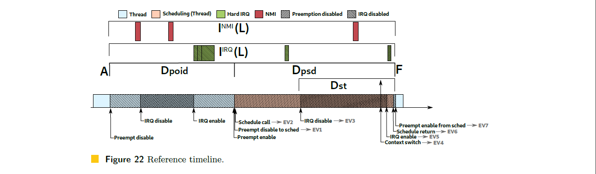

# Abstract

Linux has become a viable operating system for many real-time workloads. However, the black-box approach adopted by cyclictest, the tool used to evaluate the main real-time metric of the kernel, the scheduling latency, along with the absence of a theoretically-sound description of the in-kernel behavior, sheds some doubts about Linux meriting the real-time adjective. Aiming at clarifying the "PREEMPT_RT" Linux scheduling latency, this paper leverages the "Thread Synchronization Model" of Linux to derive a set of properties and rules defining the Linux kernel behavior from a scheduling perspective. These rules are then leveraged to derive a sound bound to the scheduling latency, considering all the sources of delays occurring in all possible sequences of synchronization events in the kernel. This paper also presents a tracing method, efficient in time and memory overheads, to observe the kernel events needed to define the variables used in the analysis. This results in an easy-to-use tool for deriving reliable scheduling latency bounds that can be used in practice. Finally, an experimental analysis compares the cyclictest and the proposed tool, showing that the proposed method can find sound bounds faster with acceptable overheads.

> Linux 已成为许多实时工作负载的可行操作系统。但是，CycliteSt 采用的黑框方法是用于评估内核的主要实时指标，调度延迟的工具，以及缺乏对内分内行为的理论上描述，提出了一些疑问关于 Linux 值得实时形容词。为了阐明"PreemenT_RT" Linux 计划延迟，本文利用 Linux 的"线程同步模型"来从调度角度来定义 Linux 内核行为的一组属性和规则。然后，将这些规则杠杆化以得出与调度延迟绑定的声音，考虑到内核中所有可能同步事件的序列中发生的所有延迟源。本文还提出了一种追踪方法，有效的时间和内存开销，以观察定义分析中使用的变量所需的内核事件。这将产生一种易于使用的工具，用于得出可以在实践中使用的可靠调度延迟范围。最后，一个实验分析比较了循环效果和提出的工具，表明所提出的方法可以更快地找到声音边界，并可以接受可接受的开销。

_Keywords and phrases_ Real-time operating systems, Linux kernel, PREEMPT_RT, Scheduling latency

# 1. Introduction

Real-time Linux has been a recurring topic in both research [5](#_bookmark42), [6](#_bookmark43), [30](#_bookmark67) and industry [10](#_bookmark47), [11](#_bookmark48), [12](#_bookmark49), [21](#_bookmark58), [39](#_bookmark76) for more than a decade. Nowadays, Linux has an extensive set of real-time related features, from theoretically-supported schedulers such as `SCHED_DEADLINE` [27](#_bookmark63) to the priority inversion control in locking algorithms and a fully-preemptive mode. Regarding the fully-preemptive mode, Linux developers have extensively reworked the Linux kernel to reduce the code sections that could delay the scheduling of the highest-priority thread, leading to the well-known "PREEMPT_RT" variant. cyclictest is the primary tool adopted in the evaluation of the fully-preemptive mode of "PREEMPT_RT" Linux [8](#_bookmark45), and it is used to compute the time difference between the expected activation time and the actual start of execution of a high-priority thread running on a CPU. By configuring the measurement thread with the highest priority and running a background taskset to generate disturbance, cyclictest is used in practice to measure the `scheduling latency` of each CPU of the system. Maximum observed latency values generally range from a few microseconds on single-CPU systems to 250 microseconds on non-uniform memory access systems [35](#_bookmark72), which are acceptable values for a vast range of applications with sub-millisecond timing precision requirements. This way, "PREEMPT_RT" Linux closely fulfills theoretical fully-preemptive system assumptions that consider atomic scheduling operations with negligible overheads.

> 实时 linux 在研究 [5](#_bookmark42)，[6](#_bookmark43)，[30](#_bookmark67)and industry [10](#_bookmark47)，[11](#_Bookmark48)，[12](#_bookmark49)，[21](#_bookmark58)，[39](#_bookmark76) 十多年来。如今，Linux 具有一组广泛的实时相关功能，从理论支持的调度程序(例如 `Sched_deadline`)[27](#_bookmark63) 到锁定算法的优先反转控制和完全 prement 的模式。关于完全抢先的模式，Linux 开发人员已广泛重新设计 Linux 内核，以减少可能延迟最高优先级线程计划的代码部分，从而导致众所周知的 "PREEMPT_RT" 变体。Cyclictest 是评估 "PREEMPT_RT" Linux [8](#_bookmark45) 评估全面率的主要工具 - 在 CPU 上运行的优先线程。通过配置具有最高优先级的测量线程并运行背景任务集以生成干扰，可以使用 Cyclictest 来测量系统每个 CPU 的"调度延迟"。最大观察到的延迟值通常范围从单 CPU 系统上的几微秒到非均匀的内存访问系统上的 250 微秒 [35](#_bookmark72)，它们是具有子毫米时序精度的广泛应用的可接受值要求。这样，"PREEMPT_RT" Linux 紧密实现了理论上的完全抢先的系统假设，这些系统假设考虑了原子调度的操作，并可以忽略不计。

Despite its practical approach and the contributions to the current state-of-art of real-time Linux, cyclictest has some known limitations. The main one arises from the opaque nature of the latency value provided by cyclictest [4](#_bookmark41). Indeed, it only informs about the latency value, without providing insights on its root causes. The tracing features of the kernel are often applied by developers to help in the investigation. However, the usage of tracing is not enough to resolve the problem: the tracing overhead can easily mask the real sources of latency, and the excessive amount of data often drives the developer to conjunctures that are not the actual cause of the problem. For these reasons, the debug of a latency spike on Linux generally takes a reasonable amount of hours of very specialized resources.

> 尽管具有实用的方法以及对实时 Linux 的最新目前的贡献，但 Cyclictest 仍有一些已知局限性。主要的是 Cyclictest [4](#_bookmark41)。实际上，它仅告知潜伏价值，而无需提供有关其根本原因的见解。开发人员经常采用内核的追踪特征来帮助调查。但是，跟踪的用法不足以解决问题：跟踪开销可以轻松掩盖实际的延迟来源，并且大量的数据通常会使开发人员进入不是问题的实际原因的结合。由于这些原因，在 Linux 上的延迟尖峰的调试通常需要花费合理的小时非常专业的资源。

A common approach in the real-time systems theory is the categorization of a system as a set of independent variables and equations that describe its integrated timing behavior. However, the complexity of the execution contexts and fine-grained synchronization of the "PREEMPT_RT" make application of classical real-time analysis for Linux difficult. Linux kernel complexity is undoubtedly a barrier for both expert operating system developers and real-time systems researchers. The absence of a theoretically-sound definition of the Linux behavior is widely known, and it inhibits the application of the rich arsenal of already existing techniques from the real-time theory. Also, it inhibits the development of theoretically-sound analysis that fits all the peculiarities of the Linux task model [23](#_bookmark60).

> 实时系统理论中的一种常见方法是将系统分类为描述其集成时间行为的一组自变量和方程。但是，执行上下文的复杂性和 "PREEMPT_RT" 的细粒度同步使经典的实时分析在 Linux 上的应用很难。Linux 内核复杂性无疑是专家操作系统开发人员和实时系统研究人员的障碍。众所周知，没有理论上的 Linux 行为定义，它抑制了实时理论中已经存在的技术的丰富武器库的应用。此外，它抑制了理论上的分析的开发，该分析适合 Linux 任务模型的所有特殊性 [23](#_bookmark60)。

Aware of the situation, researchers and developers have been working together in the creation of models that explain the Linux behavior using a formal notation, abstracting the code complexity [2](#_bookmark39). The "Thread Synchronization Model for the fully-preemptive PREEMPT RT Linux Kernel" [14](#_bookmark50) proposes an automata-based model to explain the synchronization dynamics for the `de facto` standard for real-time Linux. Among other things, the model can be used as an abstraction layer to translate the kernel dynamics as analyzed by real-time Linux kernel developers to the abstractions used in the real-time scheduling theory.

> 意识到这种情况，研究人员和开发人员一直在使用正式符号来解释 Linux 行为的模型，从而将代码复杂性抽象 [2](#_bookmark39)。"全面率先抢先的 RT Linux 内核的线程同步模型" [14](#_bookmark50) 提出了一个基于自动机的模型，以解释实时 Linux 的 `feact feact'标准的同步动力学。除其他事项外，该模型可用作抽象层，以将实时 Linux 内核开发人员分析的内核动力学转换为实时调度理论中使用的抽象。

_Paper approach and contributions:_

This paper leverages the "Thread Synchronization Model" [14] of Linux to derive a set of properties and rules defining the Linux kernel behavior from a scheduling perspective. These properties are then leveraged in an analysis that derives a theoretically-sound bound to the scheduling latency that comprehensively considers the sources of delays, including all possible synchronization flows in the kernel code. The analysis builds upon a set of practically-relevant modeling variables inspired by the foundational principles behind the development of the "PREEMPT_RT" Linux Kernel. This paper also presents an efficient tracing method to observe the kernel events, which are used to define observed values for the variables used in the analysis, while keeping the runtime overhead and storage space to figures that make its use feasible in practice. The tool also analyzes the trace, serving to distinguish the various sources of the latency. Moreover, by exploring the interference caused by adopting different interrupt characterizations, the tool also derives latency bounds based on real execution traces. Finally, the experimental section compares the results obtained by the cyclictest and the proposed tool, showing that the proposed method can find sound bounds faster with acceptable overheads.

> 本文利用线程同步 Linux 的模型[14]，以得出定义 Linux 内核行为的一组属性和规则从计划的角度来看。然后，将这些属性在分析中利用，该分析得出了一个理论上绑定到计划延迟的理论上，该潜伏期全面考虑了延迟的来源，包括内核代码中的所有可能同步流。该分析建立在一组与 "PREEMPT_RT" Linux 内核开发背后的基础原理启发的实际相关的建模变量。本文还提出了一种有效的跟踪方法来观察内核事件，该方法用于定义分析中使用的变量的观察值，同时将运行时的开销空间和存储空间保持在实践中可行的数字。该工具还分析了迹线，以区分延迟的各种来源。此外，通过探索通过采用不同的中断特征引起的干扰，该工具还基于实际执行跟踪来衍生潜伏期范围。最后，实验部分比较了 Cyclittest 和提议的工具获得的结果，表明所提出的方法可以更快地找到声音边界，并使用可接受的开销。

# 2. Background

This section provides background information on the main concepts used in this paper, and discusses related research works.

> 本节提供了有关本文使用的主要概念的背景信息，并讨论了相关的研究工作。

## 2.1 Linux Execution Contexts, Scheduling Dynamics, and Tracing(Linux 执行上下文，调度动态和跟踪)

With the "PREEMPT_RT" patchset, Linux has four different preemption models for kernel space activities. This paper targets the fully-preemptive mode, in which there are three different execution contexts: non-maskable interrupts (NMI), maskable interrupts (IRQs), and threads [20](#_bookmark57). Both NMIs and IRQs are asynchronous interrupts, i.e., mechanisms used to deliver events coming either from external hardware or by code running on other CPUs via inter-processor interrupts. The interrupt controller manages interrupts, both queueing and dispatching one NMI per-CPU and multiple IRQs. For each CPU, the NMI is the highest-priority interrupt, so it postpones and preempts IRQs. As a design choice, Linux (in the fully-preemptive mode) handles IRQs with IRQs disabled. Hence an IRQ cannot preempt another IRQ. Threads have no control over the NMI, but they can delay the execution of IRQs by temporarily disabling (masking) them.

> 借助 "PREEMPT_RT" 补丁程序，Linux 具有四个不同的内核空间活动的抢占模型。本文针对完全抢占的模式，其中有三种不同的执行上下文：不可掩盖的中断(NMI)，可掩盖的中断(IRQ)和线程 [20](#_bookmark57)。NMIS 和 IRQ 都是异步中断的，即用于传递来自外部硬件的事件或通过通过处理间处理器中断在其他 CPU 上运行的代码的机制。中断控制器可以管理中断，包括排队和派遣一个 NMI 每 CPU 和多个 IRQ。对于每个 CPU，NMI 是最高优先级的中断，因此它推迟并抢占 IRQ。作为设计选择，Linux(在完全抢先的模式下)通过禁用 IRQ 来处理 IRQ。因此，IRQ 不能抢占另一个 IRQ。线程无法控制 NMI，但是它们可以通过临时禁用(掩盖)来延迟 IRQ 的执行。

Given the potential interference on the execution of threads, one of the design goals of "PREEMPT_RT" was to reduce the code executing in interrupt context to the bare minimum, by moving most of it to thread context. Despite the existence of different memory contexts in which a regular program can run, like kernel threads, or the process context in the user-space, from the scheduling viewpoint they are all threads. Linux has not one but five schedulers. When invoked, the set of schedulers are queried in a fixed order. The following schedulers are checked: (i) stop-machine, a pseudo-scheduler used to execute kernel facilities, (ii) `SCHED_DEADLINE` [27](#_bookmark63), (iii) the fixed-priority real-time scheduler, (iv) the completely fair scheduler (CFS), (v) the IDLE scheduler. Every time the schedulers execute, the highest-priority thread is selected for a context switch. When no ready threads are available, the IDLE scheduler returns the `idle thread`, a particular thread always ready to run. For simplicity, we refer hereafter with the term "scheduler" when mentioning the kernel code handling all the scheduling operations related to all five schedulers. The scheduler is called either voluntarily by a thread leaving the processor, or involuntarily, to cause a preemption. Any currently executing thread can postpone the execution of the scheduler while running in the kernel context by either disabling preemption or the IRQs. It is a goal of the fully-preemptive kernel developers to reduce the amount of time in which sections of code can postpone the scheduler execution.

> 鉴于对线程执行的潜在干扰，"PREEMPT_RT" 的设计目标之一是通过将大部分将其移至线程上下文中，将中断上下文中的代码执行到裸机。尽管存在不同的内存上下文，在这些内存上下文中，从计划观点来看，常规程序可以运行，例如内核线程或用户空间中的过程上下文。它们都是线程。Linux 没有一个，而是五个调度程序。调用后，按固定顺序查询调度程序集。检查了以下调度程序：
> (i)用来执行内核设施的伪安装程序 Stop-Machine，
> (ii)`SCHED_DEADLINE` [27](#_bookmark63)，
> (iii)固定优先实时的实时调度程序
> (iv)完全公平的调度程序(cfs)，
> (v)空闲调度程序。
> 每次调度程序执行时，都会为上下文开关选择最高优先级线程。当没有准备好线程可用时，空闲调度程序将返回"idle thread"，特定线程随时可以运行。为了简单起见，我们在提及所有与所有五个调度程序有关的内核代码处理所有调度操作时，使用"调度程序"一词引用。调度程序是由离开处理器的线程自愿调用的，或者是非自愿的，以造成抢先。当前执行线程的任何当前执行线程都可以通过禁用 preekention 或 IRQ 在内核上下文中推迟调度程序的执行。这是完全抢先的内核开发人员的目标，以减少代码节可以推迟执行程序的时间的时间。

> 
> Figure 1 Example of automaton: the NMI generator (Operation O1).

Linux has an advanced set of tracing methods [28](#_bookmark65). An essential characteristic of the Linux tracing feature is its efficiency. Currently, the majority of Linux distributions have the tracing features enabled and ready to use. When disabled, the tracing methods have nearly zero overhead, thanks to the extensive usage of runtime code modifications. Currently, there are two main interfaces by which these features can be accessed from user-space: perf and ftrace. The most common action is to record the occurrence of events into a trace-buffer for post-processing or human interpretation of the events. Furthermore, it is possible to take actions based on events, such as to record a _stacktrace_. Moreover, tools can also hook to the trace methods, processing the events in many different ways, and also be leveraged for other purposes. For example, the Live Patching feature of Linux uses the function tracer to hook and deviate the execution of a problematic function to a revised version of the function that fixes a problem [32](#_bookmark69). A similar approach was used for runtime verification of the Linux kernel, proving to be an efficient approach [18](#_bookmark55).

> Linux 具有一组高级的跟踪方法 [28](#_bookmark65)。Linux 追踪功能的一个基本特征是其效率。当前，大多数 Linux 发行版具有启用和准备使用的跟踪功能。禁用时，由于广泛使用运行时代码修改，因此跟踪方法的开销几乎为零。当前，有两个主要接口可以从用户空间：perf 和 ftrace 访问这些功能。最常见的动作是记录事件的发生在痕量逃避器中，以进行后处理或人类对事件的解释。此外，可以根据事件采取措施，例如记录 _stackTrace_。此外，工具还可以挂钩跟踪方法，以多种不同方式处理事件，并将其用于其他目的。例如，Linux 的实时修补功能使用函数示踪剂将有问题的函数钩住和偏离解决问题的函数的修订版 [32](#_bookmark69)。使用类似的方法进行 Linux 内核的运行时验证，证明是一种有效的方法 [18](#_Bookmark55)。

## 2.2 Automata Models and the "PREEMPT_RT" Synchronization Model(自动机型和 "PREEMPT_RT" 同步模型)

An automaton is a well-known formal method, utilized in the modeling of Discrete Event Systems (DES). The evolution of a DES is described with all possible sequences of events $e_{1}, e_{2}, e_{3}, \ldots e_{n}$, with $e_{i} \in E$, defining the language $\mathcal{L}$ that describes the system.

> 自动机是一种众所周知的形式化方法，用于离散事件系统 (DES) 的建模。DES 的演变用所有可能的事件序列 $e_{1}, e_{2}, e_{3}, \ldots e_{n}$ 来描述，其中 $e_{i} \in E$，定义了 描述系统的语言 $\mathcal{L}$。

Automata are characterized by a directed graph or state transition diagram representation. For example, consider the event set $E=\{n m i_entry, nmi_exit\}$ and the state transition diagram in Figure 1, where nodes represent system states, labeled arcs represent transitions between states, the arrow points to the initial state, and the nodes with double circles are marked states, i.e., safe states of the system.

> 自动机的特征在于有向图或状态转换图表示。例如，考虑图 1 中的事件集 $E=\{n m i_entry, nmi_exit\}$ 和状态转换图，其中节点表示系统状态，标记的弧表示状态之间的转换，箭头指向初始状态，节点 双圆圈是标记状态，即系统的安全状态。

Formally, a deterministic automaton, denoted by $G$, is a tuple $G=\left\{X, E, f, x_{0}, X_{m}\right\}$; where: $X$ is the set of states; $E$ is the set of events; $f: X \times E \rightarrow X$ is the transition function, defining the state transition between states from $X$ due to events from $E ; x_{0}$ is the initial state and $X_{m} \subseteq X$ is the set of marked states.

> 形式上，用 $G$ 表示的确定性自动机是一个元组 $G=\left\{X, E, f, x_{0}, X_{m}\right\}$; 其中：$X$ 是状态集；$E$ 是事件集；$f: X \times E \rightarrow X$ 是转换函数，定义了由于来自 $E$ 的事件，来自 $X$ 的状态之间的状态转换；$x_{0}$ 是初始状态，$X_{m} \subseteq X$ 是标记状态集。

An important operation is the parallel composition of two or more automata that are combined to compose a single, augmented-state, automaton [7], enabling the model of complex systems using the modular approach. In the modular approach, the system is modeled as a set of two classes of automata: generators and specifications. Each sub-system has a generator of events modeled independently. The synchronization rules of each sub-system are stated as a set of specification automata. Each specification synchronizes the actions of two or more generators. The parallel composition of all the generators and specifications creates the synchronized model [33].

> 一个重要的操作是将两个或多个自动机的并行组成组合在一起，这些组合组成了单个增强状态，自动机[7]，可以使用模块化方法启用复杂系统的模型。在模块化方法中，该系统被建模为两类自动机的一组：生成器和规格。每个子系统都有一个独立建模的事件的发生器。每个子系统的同步规则称为一组规范自动机。每个规范都同步了两个或多个生成器的动作。所有发电机和规格的并行组成创建了同步模型[33]。

The Thread Synchronization Model for the "PREEMPT_RT" Linux Kernel [14] proposes an automata-based model for describing the behavior of threads in the Linux "PREEMPT_RT" kernel. The model defines the events and how they influence the timeline of threads' execution, comprising the preemption control, interrupt handlers, interrupt control, scheduling and locking, describing the delays occurred in this operation in the same granularity used by kernel developers. The model is constructed using the modular approach.

> "PREEMPT_RT" Linux 内核[14]的线程同步模型提出了一个基于自动机的模型，用于描述 Linux"PreemenT_RT"内核中线程的行为。该模型定义事件及其如何影响线程执行的时间表，包括预先控制，中断处理程序，中断控制，调度和锁定，描述了该操作中的延迟，以与内核开发人员使用的相同粒度发生。该模型是使用模块化方法构建的。

## 2.3 Related Work

Abeni et al. [1](#_bookmark38) defined a metric similar to cyclictest, evaluating various OS latency components of several standard and real-time Linux kernels existing at the time (2002).

> Abeni 等。[1](#_bookmark38) 定义了类似于 Cyclictest 的度量，评估了当时存在的几种标准和实时 Linux 内核的各种 OS 延迟组件(2002)。

Matni and Dagenais [29](#_bookmark66) proposed the use of automata for analyzing traces generated by the kernel of an operating system. Automata are used to describe patterns of problematic behavior. An off-line analyzer checks for their occurrences. Cerqueira and Brandenburg [9](#_bookmark46) described experiments with cyclictest to evaluate the scheduling latency experienced by real-time tasks under $LITMUS^{RT}$, vanilla Linux and Linux with the "PREEMPT_RT" patch. The authors also discussed the advantages and limitations of using cyclictest for estimating the capability of a system to provide temporal guarantees. A similar experimental study is presented in [22](#_bookmark59). Reghanzani et al. [36](#_bookmark73) empirically measured the latencies of a real-time Linux system under stress conditions in a mixed-criticality environment.

> Matni 和 Dagenais [29](#_bookmark66) 提出了使用自动机对操作系统内核生成的痕迹。自动机用于描述有问题行为的模式。离线分析仪检查其发生的情况。Cerqueira 和 Brandenburg [9](#_bookmark46) 描述了使用 Cyclictest 的实验，以评估$ LITMUS^{rt} $下的实时任务经历的时间表延迟，vanilla linux 和 linux 和 "PREEMPT_RT" 补丁。作者还讨论了使用 Cyclictest 来估计系统提供时间保证能力的优势和局限性。[22](#_bookmark59)。Reghanzani 等。[36](#_bookmark73) 在混合批评环境中，在应力条件下，经验测量了实时 Linux 系统的潜伏期。

Herzog et al. [24](#_bookmark61) presented a tool that systematically measures interrupt latency, at run-time, in the Linux vanilla kernel. No attempt is made to model Linux kernel scheduling. Regnier et al. [37](#_bookmark74) presented an evaluation of the timeliness of interrupt handling in Linux.

> Herzog 等。[24](#_bookmark61) 提出了一个工具，该工具在运行时，在 Linux Vanilla 内核中系统地中断延迟。没有尝试建模 Linux 内核调度。Regnier 等。[37](#_bookmark74) 对 Linux 中断处理的及时性进行了评估。

The ftrace preemptirqsoff tracer [38](#_bookmark75) enables the tracing of functions with either preemption or IRQs disabled, trying to capture the longest window. The approach in [38](#_bookmark75) does not differentiate between interference due to interrupts and the contribution due to different code segments disabling preemption or interrupts. Moreover, by adding tracing of functions it adds overhead to the measurement, thus potentially heavily affecting the result, often mispointing the real source of the latency.

> Ftrace Preegnerqsoff Tracer [38](#_bookmark75) 启用使用 Preegrient 或 IRQS 禁用的功能的示踪，试图捕获最长的窗口。[38](#_bookmark75) 中的方法[没有区分因中断而导致的干扰以及由于不同的代码段禁用了预先抢先或中断而引起的贡献。此外，通过添加函数的跟踪，它将其添加到测量上的开销，从而可能严重影响结果，通常会误解潜伏期的真实来源。

Previous work in [20](#_bookmark57) and [14](#_bookmark50) used the timeline and automata-based models, respectively, to describe the Linux kernel behavior regarding threads and interrupt handlers context switches. This work uses the "Thread Synchronization Model" [14](#_bookmark50) as the description of a single-CPU "PREEMPT_RT" Linux system configured in the fully-preemptive mode. The advantages of using the model is many-fold:

> [20](#_bookmark57) 和 [14](#_bookmark50) 中的先前工作[分别使用了基于时间轴和基于自动机的模型，以描述有关线程和中断处理器上下文开关的 Linux 内核行为。这项工作使用"线程同步模型" [14](#_bookmark50) 作为以完全率模式配置的 单 CPU "PREEMPT_RT" linux 系统的描述。使用该模型的优点是很多折叠：

1. it was developed in collaboration with kernel developers, and widely discussed by us with both practitioners [15](#_bookmark52), [16](#_bookmark53) and academia [13](#_bookmark51), [19](#_bookmark56);
2. the model is deterministic, i.e, in a given state a given event can cause only one transition;
3. the model was extensively verified;
4. it abstracts the code complexity by using a set of small automata, each one precisely describing a single behavior of the system. Building upon these approaches, in this work we derive a set of properties and rules defining the Linux kernel scheduling behavior, from the mentioned "Thread Synchronization Model" [14](#_bookmark50) based on automata. These properties are then used to derive a theoretically-sound bound to the scheduling latency. The proposed bound is based on a formalization of the Linux kernel behavior, where the value of the variables is experimentally measured. To the best of our knowledge, this is the first time that such a detailed analysis of the Linux scheduling behavior is done.

> 1. 它是与内核开发人员合作开发的，我们与从业者 [15](#_bookmark52)、[16](#_bookmark53) 和学术界 [13](#_bookmark51)、[19](#_bookmark56) 进行了广泛讨论 );
> 2. 模型是确定性的，即在给定状态下，给定事件只能导致一次转换；
> 3. 模型经过广泛验证；(4)
> 4. 它通过使用一组小型自动机来抽象代码复杂性，每个自动机都精确地描述系统的单个行为。在这些方法的基础上，在这项工作中，我们从提到的基于自动机的"线程同步模型"[14](#_bookmark50) 中推导出一组定义 Linux 内核调度行为的属性和规则。然后使用这些属性来推导出理论上合理的调度延迟范围。提议的边界基于 Linux 内核行为的形式化，其中变量的值是通过实验测量的。据我们所知，这是第一次对 Linux 调度行为进行如此详细的分析。

# 3 System Model

The task set is composed of a single NMI $\tau^{\mathrm{NMI}}$, a set $\Gamma^{\mathrm{IRQ}}=\left\{\tau_{1}^{\mathrm{IRQ}}, \tau_{2}^{\mathrm{IRQ}}, \ldots\right\}$ of maskable interruptions (IRQ for simplicity), and a set of threads $\Gamma^{\mathrm{THD}}=\left\{\tau_{1}^{\mathrm{THD}}, \tau_{2}^{\mathrm{THD}}, \ldots\right\}$. The NMI, IRQs, and threads are subject to the scheduling hierarchy discussed in Section 2.1, i.e., the NMI has always a higher priority than IRQs, and IRQs always have higher priority than threads. Given a thread $\tau_{i}^{\text {THD}}$, at a given point in time, the set of threads with a higher-priority than $\tau_{i}^{\mathrm{THD}}$ is denoted by $\Gamma_{\mathrm{HP}_{i}}^{\mathrm{THD}}$. Similarly, the set of tasks with priority lower than $\tau_{i}^{\mathrm{THD}}$ is denoted by $\Gamma_{\mathrm{LP}_{i}}^{\mathrm{THD}}$. Although the schedulers might have threads with the same priority in their queues, only one among them will be selected to have its context loaded, and consequently, starting to run. Hence, when scheduling, the schedulers elect a single thread as the highest-priority one.

> 任务集由单个 NMI $\tau^{\mathrm{NMI}}$、一组 $\Gamma^{\mathrm{IRQ}}=\left\{\tau_{1}^{\mathrm{IRQ}}、\tau_{2}^{\mathrm{IRQ}}、\ldots\right\}$ 可屏蔽中断(为简单起见为 IRQ)和一组线程 $\Gamma^{\mathrm{THD}}=\left\{\tau_{1}^{\mathrm{THD}}, \tau_{2}^{\mathrm{THD}}, \ldots\right\}$。NMI、IRQ 和线程服从于 2.1 节中讨论的调度层次结构，即 NMI 总是比 IRQ 具有更高的优先级，而 IRQ 总是比线程具有更高的优先级。给定一个线程 $\tau_{i}^{\text {THD}}$，在给定时间点，优先级高于 $\tau_{i}^{\mathrm{THD}}$ 的线程集合表示为 $\Gamma_{\mathrm{HP}_{i}}^{\mathrm{THD}}$。同样，优先级低于 $\tau_{i}^{\mathrm{THD}}$ 的任务集表示为 $\Gamma_{\mathrm{LP}_{i}}^{\mathrm{THD}}$。尽管调度程序在其队列中可能有具有相同优先级的线程，但只会选择其中一个来加载其上下文，并因此开始运行。因此，在调度时，调度器会选择一个线程作为最高优先级线程。

> 
> Figure 2 IRQ disabled by software (O2).
> Figure 3 IRQs disabled by hardware (O3).
> Figure 4 Context switch generator (04).
> Figure 5 Context switch generator (05).
> Figure 6 Preempt disable (06).
> Figure 7 Scheduling context (07).
> Figure 8 Thread runnable/sleepable (08).
> Figure 9 Need re-schedule operation (09).

The system model is formalized using the modular approach, where the `generators` model the independent action of tasks and synchronization primitives, and the `specification` models the synchronized behavior of the system. The next sections explains the `generators` as the basic operations of the system, and the specifications as a set of `rules` that explains the system behavior.

> 系统模型使用模块化方法形式化，其中"生成器"对任务和同步原语的独立动作进行建模，"规范"对系统的同步行为进行建模。接下来的部分将"生成器"解释为系统的基本操作，并将规范解释为一组解释系统行为的"规则"。

## 3.1 Basic Operations

This section describes `generators` relevant for the scheduling latency analysis, starting with the interrupt behavior:

> 本节介绍了与调度延迟分析相关的"生成器"，从中断行为开始：

**O1**: The NMI context starts with the entry of the NMI handler (nmi_entry), and exits in the return of the handler (nmi_exit). This operation is modeled as in Figure [1](#_bookmark2) (in Section [2](#background)).
**O2**: Linux allows threads to temporarily mask interrupts (local_irq_disable), in such a way to avoid access to shared data in an inconsistent state. Threads need to unmask interrupts (local_irq_enable) at the end of the critical section, as modeled in Figure [2](#_bookmark4).
**O3**: To enforce synchronization, the processor masks interrupts before calling an interrupt handler on it. IRQs stays masked during the entire execution of an interrupt handler (hw_local_irq_disable). Interrupts are unmasked after the return of the handler (hw_local_irq_enable), as shown in Figure [3](#_bookmark4). In the model, these events are used to identify the begin and the return of an IRQ execution.

> **O1**：NMI 上下文从 NMI 处理程序的入口(nmi_entry)开始，在处理程序的返回(nmi_exit)中退出。此操作的模型如图 [1](#_bookmark2)(在第 [2](#background) 部分)。
> **O2**：Linux 允许线程暂时屏蔽中断 (local_irq_disable)，以避免在不一致的状态下访问共享数据。线程需要在临界区末尾取消屏蔽中断 (local_irq_enable)，如图 [2](#_bookmark4) 中建模。
> **O3**：为了强制同步，处理器在调用中断处理程序之前屏蔽中断。在中断处理程序 (hw_local_irq_disable) 的整个执行期间，IRQ 保持屏蔽状态。在处理程序 (hw_local_irq_enable) 返回后，中断将被取消屏蔽，如图 [3](#_bookmark4) 所示。在模型中，这些事件用于标识 IRQ 执行的开始和返回。

The reference model considers two threads: the thread under analysis and an arbitrary other thread (including the idle thread). The corresponding operations are discussed next.

> 参考模型考虑了两个线程：分析的线程和任意的其他线程(包括空闲线程)。接下来将讨论相应的操作。

**O4**: The thread is not running until its context is loaded in the processor (sched_switch_in). The context of a thread can be unloaded by a suspension (sched_switch_suspend), blocking (`sched_switch_blocking`), or preemption (`sched_switch_preempt`), as in Fig- ure [4](#_bookmark4).
**O5**: The model considers that there is always `another thread` ready to run. The reason is that, on Linux, the `idle state` is implemented as a thread, so at least the `idle thread` is ready to run. The other thread can have its context unloaded (`sched_switch_out_o`) and loaded (`sched_switch_in_o`) in the processor, as modeled in Figure [5](#_bookmark4).
**O6**: The preemption is enabled by default. Although the same `function` is used to disable preemption, the model distinguishes the different reasons to disable preemption, as modeled in Figure [6](#_bookmark4). The preemption can be disabled either to postpone the scheduler execution (`preempt_disable`), or to protect the scheduler execution of a recursive call (`preempt_disable_sched`). Hereafter, the latter mode is referred to as `preemption disabled to call the scheduler` or `preemption disabled to schedule`.
**O7**: The scheduler starts to run selecting the highest-priority thread (schedule_entry, in Figure [7](#_bookmark4)), and returns after scheduling (schedule_exit).
**O8**: Before being able to run, a thread needs to be awakened (`sched_waking`). A thread can set its state to `sleepable` (`sched_set_state_sleepable`) when in need of resources. This operation can be undone if the thread sets its state to runnable again (`sched_set_state_runnable`). The automata that illustrates the interaction among these events is shown in Figure [8](#_bookmark4).
**O9**: The set need re-schedule (sched_need_resched) notifies that the currently running thread is not the highest-priority anymore, and so the current CPU needs to re-schedule, in such way to select the new highest-priority thread (Figure [9](#_bookmark4)).

> **O4**：线程在其上下文加载到处理器 (sched_switch_in) 之前不会运行。线程的上下文可以通过挂起 (sched_switch_suspend)、阻塞 (`sched_switch_blocking`) 或抢占 (`sched_switch_preempt`) 来卸载，如图 [4](#_bookmark4) 所示。
> **O5**：模型认为总是有"另一个线程"准备运行。原因是，在 Linux 上，"空闲状态"是作为线程实现的，因此至少"空闲线程"已准备好运行。另一个线程可以在处理器中卸载 (`sched_switch_out_o`) 和加载 (`sched_switch_in_o`) 上下文，如图 [5](#_bookmark4) 中建模。
> **O6**：默认启用抢占。尽管使用相同的"函数"来禁用抢占，但该模型区分了禁用抢占的不同原因，如图 [6](#_bookmark4) 中建模。可以禁用抢占以推迟调度程序执行(`preempt_disable`)，或保护调度程序执行递归调用(`preempt_disable_sched`)。此后，后一种模式被称为"禁止抢占调用调度器"或"禁止抢占调度"。
> **O7**：调度器选择最高优先级的线程开始运行(schedule_entry，图 [7](#_bookmark4))，调度完成后返回(schedule_exit)。
> **O8**：在能够运行之前，线程需要被唤醒(`sched_waking`)。当需要资源时，线程可以将其状态设置为"可睡眠"("sched_set_state_sleepable")。如果线程再次将其状态设置为可运行 (`sched_set_state_runnable`)，则可以撤消此操作。说明这些事件之间交互的自动机如图 [8](#_bookmark4) 所示。
> **O9**: set need re-schedule (sched_need_resched) 通知当前正在运行的线程不再是最高优先级，因此当前 CPU 需要重新调度，以选择新的最高优先级 线程(图 [9](#_bookmark4))。

## 3.2 Rules

The "Thread Synchronization Model" [14](#_bookmark50) includes a set of `specifications` defining the synchronization rules among _generators_(i.e., the basic operations discussed in Section [3.1](#basic-operations)). Next, we summarize a subset of rules extracted from the automaton, which are relevant to analyze the scheduling latency. Each rule points to a related specification, graphically illustrated with a corresponding figure.

> "线程同步模型"[14](#_bookmark50) 包括一组定义 _generators_ 之间同步规则的"规范"(即，第 [3.1] 节(#basic-operations)中讨论的基本操作)。接下来，我们总结了从自动机中提取的规则子集，这些规则与分析调度延迟相关。每条规则都指向一个相关的规范，并用相应的图形进行图形说明。

### **IRQ and NMI rules.**

First, we start discussing rules related to IRQs and NMI.

- **R1**: There is no specification that blocks the execution of a NMI (**O1**) in the automaton.
- **R2**: There is a set of events that are not allowed in the NMI context (Figure [10](#_bookmark8)), including:
  - **R2a**: set the need resched (**O9**).
  - **R2b**: call the scheduler (**O7**).
  - **R2c**: switch the thread context (**O4**and **O5**) **R2d**: enabling the preemption to schedule (**O6**).
- **R3**: There is a set of events that are not allowed in the IRQ context (Figure [11](#_bookmark8)), including:
  - **R3a**: call the scheduler (**O7**).
  - **R3b**: switch the thread context (**O4**and **O5**). **R3c**: enabling the preemption to schedule (**O6**).
- **R4**: IRQs are disabled either by threads (**O2**) or IRQs (**O3**), as in the model in Figure [12](#_bookmark8). Thus, it is possible to conclude that:
  - **R4a**: by disabling IRQs, a thread postpones the begin of the IRQ handlers.
  - **R4b**: when IRQs are not disabled by a thread, IRQs can run.

> 首先，我们开始讨论与 IRQ 和 NMI 有关的规则。
>
> - **R1**：没有阻止自动机中 NMI (**O1**) 执行的规范。
> - **R2**：NMI 上下文中有一组不允许的事件(图 [10](#_bookmark8))，包括：
>   - **R2a**：设置需要重新安排 (**O9**)。
>   - **R2b**：调用调度器(**O7**)。
>   - **R2c**：切换线程上下文(**O4**and **O5**) **R2d**：启用抢占调度(**O6**)。
> - **R3**：IRQ 上下文中有一组不允许的事件(图 [11](#_bookmark8))，包括：
>   - **R3a**：调用调度器(**O7**)。
>   - **R3b**：切换线程上下文(**O4**and **O5**)。**R3c**：启用抢占调度(**O6**)。
> - **R4**：IRQ 被线程 (**O2**) 或 IRQ (**O3**) 禁用，如图 [12](#_bookmark8) 中的模型。因此，可以得出以下结论：
>   - **R4a**：通过禁用 IRQ，线程推迟 IRQ 处理程序的开始。
>   - **R4b**：当 IRQ 未被线程禁用时，IRQ 可以运行。

**Thread context.** Next, synchronization rules related to the thread context are discussed. We start presenting the necessary conditions to call the scheduler (**O7**).

> **线程上下文** 接下来讨论与线程上下文相关的同步规则。我们开始提供调用调度程序的必要条件 (**O7**)。

### Necessary conditions to call and run the scheduler.(致电并运行调度程序的必要条件)

**R5**: The scheduler is called (and returns) with interrupts enabled (Figure [13](#_bookmark8)).
**R6**: The scheduler is called (and returns) with preemption disabled to call the scheduler (i.e., via the `preempt_disable_sched` event, Figure [14](#_bookmark8)).
**R7**: The preemption is never enabled by the scheduling context (Figure [15](#_bookmark8)). Regarding the context switch (**O4**and **O5**), the following conditions are required.

> **R5**：调度程序被启用了(返回)，并启用了中断(图 [13](#_bookmark8))。
> **R6**：调度程序被拨打(返回)，而返回则禁用了调度程序以调用调度程序(即，通过 `preempt_disable_sched` 事件，图 [14](#_bookmark8))。
> **R7**：调度上下文永远不会启用抢占(图 [15](#_bookmark8))。关于上下文切换(**O4** 和 **O5**)，需要满足以下条件。

### Necessary conditions for a context switch.(上下文开关的必要条件)

**R8**: The context switch occurs with interrupts disabled by threads (**O2**) and preemption disabled to schedule (**O6**, Figure [16](#_bookmark8)).
**R9**: The context switch occurs in the scheduling context (**O7**, Figure [17](#_bookmark8))

The necessary conditions to set the need resched (**O9**) and to wakeup a thread (**O8**) are the same. They are listed below, and show in Figure [18](#_bookmark8).

> **R8**：上下文切换发生在线程禁用中断(**O2**)和调度禁用抢占的情况下(**O6**，图 [16](#_bookmark8))。
> **R9**: The context switch occurs in the scheduling context (**O7**, Figure [17](#_bookmark8))
> 设置需要重新调度(**O9**)和唤醒线程(**O8**)的必要条件是相同的。它们列在下面，如图 [18](#_bookmark8) 所示。

### Necessary conditions to set the need resched and to wakeup a thread.(设置需要重新安排并唤醒线程的必要条件)

**R10**Preemption should be disabled, by any mean (**O6**).
**R11**IRQs should be masked, either to avoid IRQ (**O2**) or to postpone IRQs (**O3**).

> **R10** 无论如何都应该禁用抢占 (**O6**)。
> **R11** IRQ 应该被屏蔽，以避免 IRQ (**O2**) 或推迟 IRQ (**O3**)。

Until here, we considered necessary conditions. From now on, we will present sufficient conditions.

> 直到这里，我们考虑了必要的条件。从现在开始，我们将提出足够的条件。

### Sufficient conditions to call the scheduler and to cause a context switch.(有足够的条件来调用调度程序并导致上下文开关)

**R12**Disabling preemption to schedule (**O6**) always causes a call to the scheduler (**O7**, Figure [19](#_bookmark9)).
**R13**Calling the scheduler (**O7**) always results in a context switch (**O4**,**O5**). Recall that if the system is idle, the idle thread is executed after the context switch. (Figure [20](#_bookmark9)). **R14**Setting need resched (**O9**) always results in a context switch (**O4**,**O5**, Figure [21](#_bookmark10)).

> **R12** 禁用抢占调度 (**O6**) 总是会导致调用调度程序 (**O7**，图 [19](#_bookmark9))。
> **R13** 调用调度程序 (**O7**) 总是会导致上下文切换(**O4**、**O5**)。回想一下，如果系统空闲，则空闲线程在上下文切换后执行。(图 [20](#_bookmark9))。**R14** 设置需要重新安排(**O9**)总是导致上下文切换(**O4**，**O5**，图 [21](#_bookmark10))。

# 4 Demystifying the Real-time Linux Scheduling Latency(揭开实时 Linux 计划延迟的神秘面纱)

## 4.1 **Problem Statement**

We start defining the scheduling latency (hereafter only latency) and then we leverage the rules presented in Section [3](#system-model) and the related automaton model to derive an upper bound reflecting all the peculiarities of Linux. The `latency` experienced by a `thread instance`(also called `job`) may be informally defined as the maximum time elapsed between the instant in which it becomes ready while having the highest-priority among all ready threads, and the time instant in which it is allowed to execute its own code after the context switch has already been performed. By extension, the latency of a thread is defined as reported in Definition [1](#_bookmark7).

> 我们开始定义调度延迟(以下简称延迟)，然后我们利用第 [3](#system-model) 节中介绍的规则和相关的自动机模型来导出反映 Linux 所有特性的上限。"线程实例"(也称为"作业")所经历的"延迟"可以非正式地定义为它在所有就绪线程中具有最高优先级的同时准备就绪的瞬间与时间瞬间之间经过的最长时间 在已经执行上下文切换之后，它被允许执行自己的代码。通过扩展，线程的延迟定义为定义 [1](#_bookmark7) 中报告的。

- _Definition 1_ (Thread Scheduling Latency). The scheduling latency experienced by an arbitrary thread $\tau_{i}^{T H D} \in \Gamma^{T H D}$ is the longest time elapsed between the time A in which any job of $\tau_{i}^{\text {THD}}$ becomes ready and with the highest priority, and the time $F$ in which the scheduler returns and allows $\tau_{i}^{\text {THD}}$ to execute its code, in any possible schedule in which $\tau_{i}^{\text {THD}}$ is not preempted by any other thread in the interval $[A, F]$.

> - _定义 1_(线程调度延迟)。任意线程 $\tau_{i}^{T H D} \in \Gamma^{T H D}$ 经历的调度延迟是时间 A 之间经过的最长时间，其中 $\tau_{i}^{\  text {THD}}$ 准备好并具有最高优先级，以及调度程序返回并允许 $\tau_{i}^{\text {THD}}$ 以任何可能的方式执行其代码的时间 $F$ $\tau_{i}^{\text {THD}}$ 未被间隔 $[A, F]$ 中的任何其他线程抢占的调度。

> 
> Figure 10 Operations blocked in the NMI context (R2).
> Figure 11 Operations blocked in the IRQ context (R3).
> Figure 12 IRQ disabled by thread or IRQs (R4).
> Figure 13 The scheduler is called with interrupts enabled (R5).
> Figure 14 The scheduler is called with preemption disabled to call the scheduler(R6).
> Figure 15 The scheduler context does not enable the preemption (R7).
> Figure 16 The context switch occurs with interrupts and preempt disabled (R8).
> Figure 17 The context switch occurs in the scheduling context (R9).
> Figure 18 Wakeup and need resched requires IRQs and preemption disabled (R10 and R11).
> 
> Figure 19 Disabling preemption to schedule always causes a call to the scheduler (R12).
> Figure 20 Scheduling always causes context switch (R13).
> 
> Figure 21 Setting need resched always causes a context switch (R14).
> 
> Figure 22 Reference timeline.

For brevity, we refer next to the event that causes any job of $\tau_{i}^{\text {THD}}$ becoming ready and with the maximum priority as $\operatorname{RHP}_{i}$ event ${}^{1}$. With Definition 1 in place, this paper aims at computing a theoretically-sound upper bound to the latency experienced by an arbitrary $\tau_{i}^{\mathrm{THD}} \in \Gamma^{\mathrm{THD}}$ under analysis. To this end, we extract next some formal properties and lemmas from the operations and rules presented in Section 3. We begin determining which types of entities may prolong the latency of $\tau_{i}^{\text {THD}}$.

> 为简洁起见，我们将导致 $\tau_{i}^{\text {THD}}$ 的任何作业准备就绪且具有最高优先级的事件称为 $\operatorname{RHP}_{i}$ 事件 ${}^{1}$。根据定义 1，本文旨在计算任意 $\tau_{i}^{\mathrm{THD}} \in \Gamma^{\mathrm{THD}}$ 所经历的延迟的理论上合理的上限正在分析中。为此，我们从第 3 节中介绍的操作和规则中提取了接下来的一些形式属性和引理。我们开始确定哪些类型的实体可能会延长 $\tau_{i}^{\text {THD}}$ 的延迟。

Property 1. The scheduling latency of an arbitrary thread $\tau_{i}^{T H D} \in \Gamma^{T H D}$ cannot be prolonged due to high-priority interference from other threads $\tau_{j}^{\text {THD}} \in \Gamma_{H P_{i}}^{\text {THD}}$.

> 性质 1. 任意线程 $\tau_{i}^{T H D} \in \Gamma^{T H D}$ 的调度延迟不会因为其他线程的高优先级干扰 $\tau_{j}^{\ 而延长 文本 {THD}} \in \Gamma_{H P_{i}}^{\text {THD}}$。

Proof. By contradiction, assume the property does not hold. Then, due to the priority ordering, it means that either: (i) $\tau_{i}^{\text {THD}}$ was not the highest-priority thread at the beginning of the interval $[A, F]$ (as defined in Definition 1), or (ii) $\tau_{i}^{\text {THD}}$ has been preempted in $[A, F]$. Both cases contradict Definition 1 , hence the property follows.

> 证明。通过矛盾，假设该属性不成立。然后，由于优先级排序，这意味着： (i) $\tau_{i}^{\text {THD}}$ 在区间 $[A, F]$ 开始时不是最高优先级线程(如定义 1 中所定义)，或 (ii) $\tau_{i}^{\text {THD}}$ 已在 $[A, F]$ 中被抢占。这两种情况都与定义 1 相矛盾，因此性质如下。

Differently, Property 2 shows that the latency of a thread may be prolonged due to priority-inversion blocking caused by other threads $\tau_{j}^{\mathrm{THD}} \in \Gamma_{\mathrm{LP}_{i}}^{\mathrm{THD}}$ with a lower priority.

> 不同的是，性质 2 表明线程的延迟可能会由于其他线程引起的优先级反转阻塞而延长 $\tau_{j}^{\mathrm{THD}} \in \Gamma_{\mathrm{LP}_{  i}}^{\mathrm{THD}}$ 优先级较低。

Property 2. The latency of an arbitrary thread $\tau_{i}^{T H D} \in \Gamma^{T H D}$ can be prolonged due to low-priority blocking from other threads $\tau_{j}^{T H D} \in \Gamma_{L P_{i}}^{T H D}$.

> 性质 2. 任意线程 $\tau_{i}^{T H D} \in \Gamma^{T H D}$ 的延迟可以由于其他线程的低优先级阻塞而延长 $\tau_{j}^{T H D}  \in \Gamma_{L P_{i}}^{T H D}$。

Proof. The property follows by noting that, for example, a low-priority thread may disable the preemption to postpone the scheduler, potentially prolonging the latency of $\tau_{i}^{\text {THD}}$.

> 证明。该属性随后指出，例如，低优先级线程可能会禁用抢占以推迟调度程序，从而可能延长 $\tau_{i}^{\text {THD}}$ 的延迟。

With Property 1 and Property 2 in place, we bound the Linux latency as follows, referring to an arbitrary thread $\tau_{i}^{\text {THD}}$ under analysis. First, as a consequence of Property 1 , only the NMI and IRQs may prolong the latency due to high-priority interference, and such an interference is equal for all threads $\tau_{i}^{\text {THD}} \in \Gamma^{\text {THD}}$ since NMI and IRQs have higher priorities than threads. We model the interference due to the NMI and IRQs in a time window of length $t$ with the functions $I^{\mathrm{NMI}}(t)$ and $I^{\mathrm{IRQ}}(t)$, respectively. We then show next in Section 5 how to derive such functions. Besides interference, the latency is caused by constant kernel overheads (e.g., due to the execution of the kernel code for performing the context switch) and priority-inversion blocking (see Property 2 ), which we bound with a term $L^{\mathrm{IF}}$. In principle, the delays originating $L^{\text {IF}}$ may be different for each thread $\tau_{i}^{\text {THD}} \in \Gamma^{\mathrm{THD}}$. However, for simplicity, we conservatively bound $L^{\mathrm{IF}}$ in a thread-independent manner as discussed next in Section $4.2$ and 5 . The latency of $\tau_{i}^{\text {THD}}$ is then a function of the above delays, and is bounded by leveraging standard techniques for response-time analysis in real-time systems [3, 25, 26], i.e., by the least positive value fulfilling the following equation:

> 有了属性 1 和属性 2，我们将 Linux 延迟限制如下，参考分析中的任意线程 $\tau_{i}^{\text {THD}}$。首先，由于属性 1，只有 NMI 和 IRQ 可能会由于高优先级干扰而延长延迟，并且这种干扰对所有线程都是平等的 $\tau_{i}^{\text {THD}} \in  \Gamma^{\text {THD}}$ 因为 NMI 和 IRQ 的优先级高于线程。我们使用函数 $I^{\mathrm{NMI}}(t)$ 和 $I^{\mathrm{IRQ}}(t)$ 对长度为 $t$ 的时间窗口中的 NMI 和 IRQ 造成的干扰进行分别建模。然后，我们将在第 5 节中展示如何导出此类函数。除了干扰之外，延迟是由恒定的内核开销(例如，由于执行上下文切换的内核代码的执行)和优先级反转阻塞(参见属性 2)引起的，我们用术语 $L^{\mathrm{IF}}$。原则上，每个线程 $\tau_{i}^{\text {THD}} \in \Gamma^{\mathrm{THD}}$ 产生的延迟 $L^{\text {IF}}$ 可能不同 . 然而，为简单起见，我们保守地以线程无关的方式绑定 $L^{\mathrm{IF}}$ ，如接下来在第 $4.2$ 和第 5 节中讨论的那样。$\tau_{i}^{\text {THD}}$ 的延迟是上述延迟的函数，并且受到实时系统响应时间分析标准技术的限制 [3, 25, 26 ]，即满足以下等式的最小正值：

$$
L=L^{\mathrm{IF}}+I^{\mathrm{NMI}}(L)+I^{\mathrm{IRQ}}(L) .
$$

Next, we show how to bound $L^{\mathrm{IF}}$.

> 接下来，我们展示如何绑定 $L^{\mathrm{IF}}$。

## 4.2 Bounding $L^{IF}$

Analysis Approach. As discussed in Section 3, after the $\mathrm{RHP}_{i}$ event occurs (i.e., when $\tau_{i}^{\text {THD}}$ becomes the ready thread with the highest priority), the kernel identifies the need to schedule a new thread when the `set_need_resched` event takes place. Then, an ordered sequence of events occurs. Such events are motivated by the operations and rules discussed in Section 3, graphically illustrated in the lower part of Figure 22, and discussed below.

> 分析方法。如第 3 节所述，在 $\mathrm{RHP}_{i}$ 事件发生后(即，当 $\tau_{i}^{\text {THD}}$ 成为具有最高优先级的就绪线程时)， 当 set_need_resched 事件发生时，内核确定需要安排一个新线程。然后，发生有序的事件序列。此类事件是由第 3 节中讨论的操作和规则激发的，在图 22 的下部以图形方式说明，并在下面进行讨论。

- _EV1_ The necessary conditions to call the scheduler need to be fulfilled: IRQs are enabled, and preemption is disabled to call the scheduler. It follows from rule R5 and R6;
- _EV2_ The scheduler is called. It follows from R12;
- _EV3_ In the scheduler code, IRQs are disabled to perform a context switch. It follows from rule R8;
- _EV4_ The context switch occurs. It follows from rule R13 and R14;
- _EV5_ Interrupts are enabled by the scheduler. It follows from R5;
- _EV6_ The scheduler returns;
- _EV7_ The preemption is enabled, returning the thread its own execution flow.

> - _EV1_ 调用调度器的必要条件需要满足：启用 IRQ，禁用抢占来调用调度器。它遵循规则 R5 和 R6；
> - _EV2_ 调用调度程序。它遵循 R12；
> - _EV3_ 在调度程序代码中，IRQ 被禁用以执行上下文切换。它遵循规则 R8；
> - _EV4_ 上下文切换发生。它遵循规则 R13 和 R14；
> - _EV5_ 中断由调度程序启用。它来自 R5；
> - _EV6_ 调度器返回；
> - _EV7_ 启用抢占，返回线程自己的执行流。

Note that, depending on what the processor is executing when the $\operatorname{RHP}_{i}$ event occurs, not all the events may be involved in (and hence prolong) the scheduling latency. Figure 21 illustrates all the allowed sequences of events from the occurrence of the `set_need_resched` event (caused by $\operatorname{RHP}_{i}$) until the context switch (EV4), allowing the occurrence of the other events (EV5-EV7). According to the automaton model, there are five possible and mutually-exclusive cases, highlighted with different colors in Figure 21. Our strategy for bounding $L^{\mathrm{IF}}$ consists in deriving an individual bound for each of the five cases, taking the maximum as a safe bound. To derive the five cases, we first distinguish between: (i) if $\mathrm{RHP}_{i}$ occurs when the current thread $\tau_{j}^{\mathrm{THD}} \in \Gamma_{\mathrm{LP}_{i}}^{\mathrm{THD}}$ is in the scheduler execution flow, both voluntarily, or involuntarily as a consequence of a previous `set_need_resched` occurrence, after disabling the preemption to call the scheduler and, (ii) otherwise.

> 请注意，根据 $\operatorname{RHP}_{i}$ 事件发生时处理器正在执行的操作，并非所有事件都可能涉及(并因此延长)调度延迟。图 21 说明了所有允许的事件序列，从 `set_need_resched` 事件(由 $\operatorname{RHP}_{i}$ 引起)的发生到上下文切换 (EV4)，允许其他事件的发生 (EV5) -EV7). 根据自动机模型，有五种可能且互斥的情况，在图 21 中以不同颜色突出显示。我们的边界 $L^{\mathrm{IF}}$ 的策略包括为五个中的每一个推导一个单独的边界 情况下，将最大值作为安全界限。为了推导这五种情况，我们首先区分： \mathrm{LP}\_{i}}^{\mathrm{THD}}$ 处于调度程序执行流程中，无论是自愿的，还是由于先前的 set_need_resched 事件而非自愿的，在禁用调用调度程序的抢占之后 (ii) 否则。

We can distinguish three mutually-exclusive sub-cases of (i):

- i-a if $\operatorname{RHP}_{i}$ occurs between events EV1 and EV2, i.e., after that preemption has been disabled to call the scheduler and before the actual scheduler call (black in Figure 21);
- i-b if $\operatorname{RHP}_{i}$ occurs in the scheduler between EV2 and EV3, i.e., after that the scheduler has already been called and before interrupts have been disabled to cause the context switch (pink in Figure 21);
- i-c if $\operatorname{RHP}_{i}$ occurs in the scheduler between EV3 and EV7, i.e., after interrupts have already been masked in the scheduler code and when the scheduler returns (brown in Figure 21); In case (ii), $\operatorname{RHP}_{i}$ occurred when the current thread $\tau_{j}^{\mathrm{THD}} \in \Gamma_{\mathrm{LP}_{i}}^{\mathrm{THD}}$ is not in the scheduler execution flow. Based on the automaton of Figure 21, two sub-cases are further differentiated:
- ii-a when $\mathrm{RHP}_{i}$ is caused by an IRQ, and the currently executing thread may delay $\mathrm{RHP}_{i}$ only by disabling interruptions (green in Figure 21).
- ii-b otherwise (blue in Figure 21).

> 我们可以区分(i)的三个相互排斥的子案例：
>
> - i-a 如果 $\operatorname{RHP}_{i}$ 发生在事件 EV1 和 EV2 之间，即，在调用调度程序的抢占被禁用之后和实际调度程序调用之前(图 21 中的黑色)；
> - i-b 如果 $\operatorname{RHP}_{i}$ 出现在 EV2 和 EV3 之间的调度程序中，即在调度程序已经被调用之后并且在中断被禁用以导致上下文切换之前(图 21 中的粉红色) ;
> - i-c 如果 $\operatorname{RHP}_{i}$ 出现在 EV3 和 EV7 之间的调度程序中，即在中断已经在调度程序代码中被屏蔽之后以及调度程序返回时(图 21 中的棕色)；在情况 (ii) 中，$\operatorname{RHP}_{i}$ 发生在当前线程 $\tau_{j}^{\mathrm{THD}} \in \Gamma_{\mathrm{LP}_{i}  }^{\mathrm{THD}}$ 不在调度程序执行流程中。基于图 21 的自动机，进一步区分两个子情况：
> - ii-a 当 $\mathrm{RHP}_{i}$ 由 IRQ 引起时，当前执行的线程可能仅通过禁用中断来延迟 $\mathrm{RHP}_{i}$(图 21 中的绿色) .
> - ii-b 否则(图 21 中的蓝色)。

> Table 1 Parameters used to bound $L^{IF}$ > 

_Variables Selection._ One of the most important design choices for the analysis consists in determining the most suitable variables to be used for deriving the analytical bound. Since the very early stages of its development, the "PREEMPT_RT" Linux had as a target to minimize the code portions executed in interrupt context and the code sections in which the preemption is disabled. One of the advantages of this design choice consists indeed in the reduction of scheduling delays. Nevertheless, disabling the preemption or IRQs is sometimes merely mandatory in the kernel code. As pointed out in Property [2](#_bookmark13), threads may also disable the preemption or IRQs, e.g., to enforce synchronization, thus impacting on the scheduling latency. Building upon the design principles of the fully-preemptive "PREEMPT_RT" kernel, Table [1](#_bookmark17) presents and discusses the set of variables selected to bound the latency, which are more extensively discussed next in Sections [5](#rt_sched_latency-efficient-scheduling-latency-estimation-tool-kit), and graphically illustrated in Figure [22](#_bookmark11). Such variables considers the longest intervals of time in which the preemption and/or IRQs are disabled, taking into consideration the different disabling modes discussed in Section [3](#system-model).

> _变量选择_ 分析最重要的设计选择之一在于确定最合适的变量以用于推导分析界限。从其开发的早期阶段开始，"PREEMPT_RT"Linux 就以最小化在中断上下文中执行的代码部分和禁用抢占的代码部分为目标。这种设计选择的优点之一确实在于减少了调度延迟。然而，有时在内核代码中禁用抢占或 IRQ 只是强制性的。正如属性 [2](#_bookmark13) 中所指出的，线程也可以禁用抢占或 IRQ，例如，以强制同步，从而影响调度延迟。基于完全抢占式"PREEMPT_RT"内核的设计原则，表 [1](#_bookmark17) 介绍并讨论了为限制延迟而选择的一组变量，接下来的第 [5] 节(#rt_sched_latency -efficient-scheduling-latency-estimation-tool-kit)，并在图 [22](#_bookmark11) 中进行了图形说明。这些变量考虑了禁用抢占和/或 IRQ 的最长时间间隔，并考虑了第 [3](#system-model) 节中讨论的不同禁用模式。

_Deriving the bound._ Before discussing the details of the five cases, we present a bound on the interference-free duration of the scheduler code in Lemma [2](#_bookmark18).
_Lemma 2._ The interference-free duration of the scheduler code is bounded by $D_{PSD}$.
_Proof._ It follows by noting that by rule R6 the scheduler is called and returns with the preemption disabled to call the scheduler and, by rules R2d, R3c, and R7, the preemption is not enabled again until the scheduler returns. K

> _推导界限。_ 在讨论这五种情况的细节之前，我们在引理 [2](#_bookmark18) 中给出了调度程序代码的无干扰持续时间的界限。
> _引理 2._ 调度程序代码的无干扰持续时间受 $D_{PSD}$ 限制。
> _Proof._ 接下来要注意的是，根据规则 R6，调度程序被调用并在禁用抢占的情况下返回以调用调度程序，并且根据规则 R2d、R3c 和 R7，在调度程序返回之前不会再次启用抢占。钾

Next, we provide a bound to $L^{IF}$ in each of the five possible chains of events.

> 接下来，我们在五个可能的事件链中的每一个中为 $L^{IF}$ 提供一个绑定。

**Case (i)**. In case (i), the preemption is already disabled to call the scheduler, hence either `set_need_resched` has already been triggered by another thread $\tau_{j}^{\mathrm{THD}} \neq \tau_{i}^{\mathrm{THD}}$ or the current thread voluntarily called the scheduler. Then, due to rules R13 and R14, a context switch will occur. Consequently, the processor continues executing the scheduler code. Due to rule R5, the scheduler is called with interrupts enabled and preemption disabled, hence $\operatorname{RHP}_{i}$ (and consequently `set_need_resched`) must occur because of an event triggered by an interrupt. By rule R2, NMI cannot cause `set_need_resched`; consequently, it must be caused by an IRQ or the scheduler code itself. Due to EV3, IRQs are masked in the scheduler code before performing the context switch. We recall that case (i) divides into three possible sub-cases, depending on whether $\operatorname{RHP}_{i}$ occurs between EV1 and EV2 (case i-a), EV2 and EV3 (case i-b), or EV3 and EV7 (case i-c). Lemma 3 bounds $L^{\mathrm{IF}}$ for cases (i-a) and (i-b).

> **案例 (i)**。在情况 (i) 中，抢占已被禁用以调用调度程序，因此 `set_need_resched` 已经被另一个线程触发 $\tau_{j}^{\mathrm{THD}} \neq \tau_{i}^  {\mathrm{THD}}$ 或当前线程自愿调用调度程序。然后，由于规则 R13 和 R14，将发生上下文切换。因此，处理器继续执行调度程序代码。由于规则 R5，调度程序在启用中断和禁用抢占的情况下被调用，因此 $\operatorname{RHP}_{i}$(以及因此 `set_need_resched`)必须由于中断触发的事件而发生。根据规则 R2，NMI 不能导致 `set_need_resched`；因此，它一定是由 IRQ 或调度程序代码本身引起的。由于 EV3，IRQ 在执行上下文切换之前在调度程序代码中被屏蔽。我们记得案例 (i) 分为三个可能的子案例，这取决于 $\operatorname{RHP}_{i}$ 是否发生在 EV1 和 EV2(案例 i-a)、EV2 和 EV3(案 ​​ 例 i-b)或 EV3 之间，并且 EV7(案例 i-c)。对于情况 (i-a) 和 (i-b)，引理 3 限制 $L^{\mathrm{IF}}$。

- **Lemma 3**. In cases (i-a) and (i-b), it holds

$$
L_{(i-a)}^{I F} \leq D_{P S D}, L_{(i-b)}^{I F} \leq D_{P S D} .
$$

_Proof._ In both cases it holds that preemption is disabled to call the scheduler and IRQs have not been disabled yet (to perform the context switch) when $\mathrm{RHP}_{i}$ occurs. Due to rules R2 and R5, ${RHP}_{i}$ may only be triggered by an IRQ or the scheduler code itself. Hence, when $\mathrm{RHP}_{i}$ occurs `set_need_resched` is triggered and the scheduler performs the context switch for $\tau_{i}^{\text {THD}}$. Furthermore, in case (i-b) the processor already started executing the scheduler code when $\operatorname{RHP}_{i}$ occurs. It follows that $L^{\mathrm{IF}}$ is bounded by the interference-free duration of the scheduler code. By Lemma 2, such a duration is bounded by $D_{\text {PSD}}$. In case (i-a), the scheduler has not been called yet, but preemptions have already been disabled to schedule. By rule R12, it will immediately cause a call to the scheduler, and the preemption is not enabled again between EV1 and EV2 (rules R2d, R3c, and R7). Therefore, also for case (i-a) $L^{\mathrm{IF}}$ is bounded by $D_{\text {PSD}}$, thus proving the lemma.

> _Proof._ 在这两种情况下，当 $\mathrm{RHP}_{i}$ 发生时，它认为抢占被禁用以调用调度程序并且 IRQ 尚未被禁用(以执行上下文切换)。由于规则 R2 和 R5，${RHP}_{i}$ 只能由 IRQ 或调度程序代码本身触发。因此，当 $\mathrm{RHP}_{i}$ 发生时，`set_need_resched` 被触发，调度程序为 $\tau_{i}^{\text {THD}}$ 执行上下文切换。此外，在情况 (i-b) 中，当 $\operatorname{RHP}_{i}$ 发生时，处理器已经开始执行调度程序代码。由此可见，$L^{\mathrm{IF}}$ 受调度程序代码的无干扰持续时间限制。根据引理 2，这样的持续时间受 $D_{\text {PSD}}$ 的限制。在情况 (i-a) 中，调度程序尚未被调用，但抢占已被禁用以进行调度。根据规则 R12，它会立即调用调度程序，EV1 和 EV2 之间不会再次启用抢占(规则 R2d、R3c 和 R7)。因此，同样对于情况 (i-a) $L^{\mathrm{IF}}$ 受 $D_{\text {PSD}}$ 限制，从而证明引理。

Differently, case (i-c), in which $\mathrm{RHP}_{i}$ occurs between EV3 and EV7, i.e., after interrupts are disabled to perform the context switch, is discussed in Lemma 4.

> 不同的是，在引理 4 中讨论了情况 (i-c)，其中 $\mathrm{RHP}_{i}$ 发生在 EV3 和 EV7 之间，即，在禁用中断以执行上下文切换之后。

Lemma 4. In case (i-c), it holds

$$
L_{(i-c)}^{I F} \leq D_{S T}+D_{P A I E}+D_{P S D} .
$$

Proof. In case (i), the scheduler is already executing to perform the context switch of a thread $\tau_{j}^{\mathrm{THD}} \neq \tau_{i}^{\mathrm{THD}}$. Due to rules R2 and R5, $\mathrm{RHP}_{i}$ may only be triggered by an IRQ or the scheduler code itself. If the scheduler code itself caused $\mathrm{RHP}_{i}$ before the context switch (i.e., between EV3 and EV4), the same scenario discussed for case (i-b) occurs, and the bound of Equation 2 holds. Then, case (i-c) occurs for $\mathrm{RHP}_{i}$ arriving between EV4 and EV7 for the scheduler code, or EV3 and EV7 for IRQs. IRQs may be either disabled to perform the context switch (if $\mathrm{RHP}_{i}$ occurs between EV3 and EV5), or already re-enabled because the context switch already took place (if $\mathrm{RHP}_{i}$ occurs between EV5 and EV7). In both cases, thread $\tau_{i}^{\text {THD}}$ needs to wait for the scheduler code to complete the context switch for $\tau_{j}^{\text {THD}}$. If $\mathrm{RHP}_{i}$ occurred while IRQs were disabled (i.e., between EV3 and EV5), the IRQ causing $\mathrm{RHP}_{i}$ is executed, triggering `set_need_resched`, when IRQs are enabled again just before the scheduler returns (see rule R5).

> 证明。在情况 (i) 中，调度程序已经在执行线程 $\tau_{j}^{\mathrm{THD}} \neq \tau_{i}^{\mathrm{THD}}$ 的上下文切换。由于规则 R2 和 R5，$\mathrm{RHP}_{i}$ 只能由 IRQ 或调度程序代码本身触发。如果调度程序代码本身在上下文切换(即在 EV3 和 EV4 之间)之前导致 $\mathrm{RHP}_{i}$，则会发生针对案例 (i-b) 讨论的相同场景，并且等式 2 的界限成立。然后，情况 (i-c) 发生在 $\mathrm{RHP}_{i}$ 到达调度程序代码的 EV4 和 EV7 之间，或到达 IRQ 的 EV3 和 EV7 之间。IRQ 可能被禁用以执行上下文切换(如果 $\mathrm{RHP}_{i}$ 发生在 EV3 和 EV5 之间)，或者已经重新启用，因为上下文切换已经发生(如果 $\mathrm{RHP}  _{i}$ 出现在 EV5 和 EV7 之间)。在这两种情况下，线程 $\tau_{i}^{\text {THD}}$ 都需要等待调度程序代码完成 $\tau_{j}^{\text {THD}}$ 的上下文切换。如果 $\mathrm{RHP}_{i}$ 在 IRQ 被禁用时发生(即，在 EV3 和 EV5 之间)，导致 $\mathrm{RHP}_{i}$ 的 IRQ 被执行，触发 `set_need_resched`，当 IRQs 在调度程序返回之前再次启用(参见规则 R5)。

Hence, due to rule R14, the scheduler needs to execute again to perform a second context switch to let $\tau_{i}^{\mathrm{THD}}$ execute. As shown in the automaton of Figure 21, there may exist a possible system state in case (i-c) (the brown one in Figure 21) in which, after $\operatorname{RHP}_{i}$ occurred and before the scheduler code is called again, both the preemption and IRQs are enabled before calling the scheduler (state `pe_ie` in Figure 21). This system state is visited when the kernel is executing the non-atomic function to enable preemption, because the previous scheduler call (i.e., the one that caused the context switch for $\tau_{j}^{\text {THD}}$) enabled IRQs before returning (EV5). Consequently, we can bound $L^{\mathrm{IF}}$ in case (i-c) by bounding the interference-free durations of the three intervals: $I_{\mathrm{ST}}$, which lasts from EV3 to EV7, $I_{\text {PAIE}}$, which accounts for the kernel being in the state `pe_ie` of Figure 21 while executing EV7, and $I_{\mathrm{S}}$, where preemption is disabled to call the scheduler and the scheduler is called again to schedule $\tau_{i}^{\text {THD}}$ (from EV1 to EV7). By definition and due to Lemma 2 and rules R2d, R3c, R7, and R12, $I_{\mathrm{ST}}, I_{\mathrm{PAIE}}$, and $I_{\mathrm{S}}$ cannot be longer than $D_{\mathrm{ST}}, D_{\mathrm{PAIE}}$, and $D_{\mathrm{PSD}}$, respectively. The lemma follows by noting that the overall duration of $L^{\mathrm{IF}}$ is bounded by the sum of the individual bounds on $I_{\mathrm{ST}}, I_{\mathrm{PAIE}}$, and $I_{\mathrm{S}}$.

> 因此，由于规则 R14，调度程序需要再次执行以执行第二次上下文切换以让 $\tau_{i}^{\mathrm{THD}}$ 执行。如图 21 的自动机所示，在情况 (i-c)(图 21 中的棕色部分)中可能存在一种可能的系统状态，其中，在 $\operatorname{RHP}_{i}$ 发生之后且在调度程序代码之前 再次调用，在调用调度程序之前启用抢占和 IRQ(图 21 中的状态 `pe_ie`)。当内核执行非原子函数以启用抢占时，会访问此系统状态，因为先前的调度程序调用(即导致 $\tau*{j}^{\text {THD}}$ 上下文切换的调用 ) 在返回 (EV5) 之前启用 IRQ。因此，我们可以通过限制三个时间间隔的无干扰持续时间来限制案例 (i-c) 中的 $L^{\mathrm{IF}}$：$I_{\mathrm{ST}}$，从 EV3 持续到 EV7 ，$I_{\text {PAIE}}$，它解释了内核在执行 EV7 时处于图 21 的状态 `pe_ie`，以及 $I_{\mathrm{S}}$，其中禁止抢占以调用 scheduler 并且再次调用调度器来调度 $\tau_{i}^{\text {THD}}$(从 EV1 到 EV7)。根据定义和引理 2 以及规则 R2d、R3c、R7 和 R12，$I_{\mathrm{ST}}、I_{\mathrm{PAIE}}$ 和 $I_{\mathrm{S}}$ 不能 分别长于 $D_{\mathrm{ST}}、D_{\mathrm{PAIE}}$ 和 $D_{\mathrm{PSD}}$。引理之后注意到 $L^{\mathrm{IF}}$ 的总持续时间受 $I_{\mathrm{ST}}, I_{\mathrm{PAIE}}$ 上各个边界之和的限制 , 和 $I_{\mathrm{S}}$。

_Case (ii)._ In case (ii), $\mathrm{RHP}_{i}$ occurs when the current thread $\tau_{j}^{\mathrm{THD}} \in \Gamma_{\mathrm{LP}_{i}}^{\mathrm{THD}}$ is not in the scheduler execution flow. As a consequence of the $\mathrm{RHP}_{i}$ events, `set_need_resched` is triggered. By rule R14, triggering `set_need_resched` always result in a context switch and, since ${RHP}_{i}$ occurred outside the scheduler code, the scheduler needs to be called to perform the context switch (rule R9). Hence, we can bound $L^{IF}$ in case (ii) by individually bounding two time intervals $I_{\mathrm{S}}$ and $I_{\mathrm{SO}}$ in which the processor is executing or not executing the scheduler execution flow (from EV1 to EV7), respectively. As already discussed, the duration of $I_{\mathrm{S}}$ is bounded by $D_{\text {PSD}}$ (Lemma 2). To bound $I_{\text {SO}}$, we need to consider individually cases (ii-a) and (ii-b). Lemma 5 and Lemma 6 bound $L^{\mathrm{IF}}$ for cases (ii-a) and (ii-b), respectively.

> _情况 (ii)._ 在情况 (ii) 中，$\mathrm{RHP}_{i}$ 发生在当前线程 $\tau_{j}^{\mathrm{THD}} \in \Gamma_{  \mathrm{LP}_{i}}^{\mathrm{THD}}$ 不在调度程序执行流程中。作为 $\mathrm{RHP}_{i}$ 事件的结果，"set*need_resched"被触发。根据规则 R14，触发 set_need_resched 总是会导致上下文切换，并且由于 ${RHP}*{i}$ 发生在调度程序代码之外，因此需要调用调度程序来执行上下文切换(规则 R9)。因此，在情况 (ii) 中，我们可以通过分别限定处理器执行的两个时间间隔 $I_{\mathrm{S}}$ 和 $I_{\mathrm{SO}}$ 来限定 $L^{IF}$ 或不执行调度程序执行流程(从 EV1 到 EV7)，分别。如前所述，$I_{\mathrm{S}}$ 的持续时间受 $D_{\text {PSD}}$ 的限制(引理 2)。要绑定 $I_{\text {SO}}$，我们需要单独考虑情况 (ii-a) 和 (ii-b)。对于情况 (ii-a) 和 (ii-b)，引理 5 和引理 6 分别绑定 $L^{\mathrm{IF}}$。

Lemma 5. In case (ii-a), it holds

$$
L_{(i i-a)}^{I F} \leq D_{P O I D}+D_{P S D} .
$$

Proof. In case (ii-a) $\mathrm{RHP}_{i}$ occurs due to an IRQ. Recall from Operation O3 that when an IRQ is executing, it masks interruptions. Hence, the IRQ causing $\mathrm{RHP}_{i}$ can be delayed by the current thread or a lower-priority IRQ that disabled IRQs. When $\mathrm{RHP}_{i}$ occurs, the IRQ triggering the event disables the preemption (IRQs are already masked) to fulfill R10 and R11, and triggers `set_need_resched`. If preemption was enabled before executing the IRQ handler and if `set_need_resched` was triggered, when the IRQ returns, it first disables preemptions (to call the scheduler, i.e., `preempt_disable_sched`). It then unmasks interrupts (this is a safety measure to avoid stack overflows due to multiple scheduler calls in the IRQ stack). This is done to fulfill the necessary conditions to call the scheduler discussed in rules R5 and R6. Due to rules R3a and R12, the scheduler is called once the IRQ returns. Hence, it follows that in the whole interval $I_{\mathrm{SO}}$, either the preemption or interrupts are disabled. Then it follows that $I_{\mathrm{SO}}$ is bounded by $D_{\text {POID}}$, i.e., by the length of the longest interval in which either the preemption or IRQs are disabled. The lemma follows recalling that the duration of $I_{\mathrm{S}}$ is bounded by $D_{\text {PSD}}$.

> 证明。如果 (ii-a) $\mathrm{RHP}_{i}$ 由于 IRQ 而发生。回想一下 O3 操作，当 IRQ 正在执行时，它会屏蔽中断。因此，导致 $\mathrm{RHP}_{i}$ 的 IRQ 可以被当前线程或禁用 IRQ 的低优先级 IRQ 延迟。当 $\mathrm{RHP}_{i}$ 发生时，触发事件的 IRQ 禁用抢占(IRQ 已经被屏蔽)以完成 R10 和 R11，并触发 `set_need_resched`。如果在执行 IRQ 处理程序之前启用了抢占，并且触发了 `set_need_resched`，当 IRQ 返回时，它首先禁用抢占(调用调度程序，即 `preempt_disable_sched`)。然后它会取消屏蔽中断(这是一种安全措施，可以避免由于 IRQ 堆栈中的多个调度程序调用而导致堆栈溢出)。这样做是为了满足调用规则 R5 和 R6 中讨论的调度程序的必要条件。由于规则 R3a 和 R12，一旦 IRQ 返回，就会调用调度程序。因此，它遵循在整个区间 $I*{\mathrm{SO}}$ 中，抢占或中断被禁用。那么 $I_{\mathrm{SO}}$ 受 $D_{\text {POID}}$ 的限制，即受禁用抢占或 IRQ 的最长间隔的长度限制。引理遵循 $I_{\mathrm{S}}$ 的持续时间受 $D_{\text {PSD}}$ 的限制。

Lemma 6. In case (ii-b), it holds

$$
L_{(i i-b)}^{I F} \leq D_{P O I D}+D_{P A I E}+D_{P S D},
$$

Proof. In case (ii-b) the currently executing thread delayed the scheduler call by disabling the preemption or IRQs. The two cases in which the $\mathrm{RHP}_{i}$ event is triggered either by a thread or an IRQ are discussed below.

> 证明。在情况 (ii-b) 中，当前正在执行的线程通过禁用抢占或 IRQ 来延迟调度程序调用。$\mathrm{RHP}_{i}$ 事件由线程或 IRQ 触发的两种情况在下面讨论。

(1) $R H P_{i}$ is triggered by an IRQ. Consider first that $\mathrm{RHP}_{i}$ is triggered by an IRQ. Then, the IRQ may be postponed by a thread or a low-priority IRQ that disabled interrupts. When the IRQ is executed, it triggers `set_need_resched`. When returning, the IRQ returns to the previous preemption state ${}^{2}$, i.e, if it was disabled before the execution of the IRQ handler, preemption is disabled, otherwise it is enabled. If the preemption was enabled before executing the IRQ, the same scenario discussed for case (ii-a) occurs, and the bound of Equation 4 holds. Otherwise, if the preemption was disabled to postpone the scheduler execution, the scheduler is delayed due to priority-inversion blocking. Then it follows that when delaying the scheduler execution, either the preemption or IRQs are disabled. When preemption is re-enabled by threads and interrupts are enabled, the preemption needs to be disabled again (this time not to postpone the scheduler execution, but to call the scheduler) to fulfill the necessary conditions listed in rules R5 and R6, hence necessarily traversing the `pe_ie` state (shown in Figure 21), where both preemptions and interrupts are enabled.

> (1) $R H P_{i}$ 由 IRQ 触发。首先考虑 $\mathrm{RHP}_{i}$ 是由 IRQ 触发的。然后，IRQ 可能会被线程或禁用中断的低优先级 IRQ 推迟。当执行 IRQ 时，它会触发 set_need_resched。返回时，IRQ 返回到之前的抢占状态 ${}^{2}$，即如果在 IRQ 处理程序执行之前被禁用，则抢占被禁用，否则被启用。如果在执行 IRQ 之前启用了抢占，则会发生针对情况 (ii-a) 讨论的相同场景，并且等式 4 的界限成立。否则，如果禁用抢占以推迟调度程序的执行，则调度程序会由于优先级反转阻塞而延迟。然后，当延迟调度程序执行时，抢占或 IRQ 被禁用。当线程重新启用抢占并启用中断时，需要再次禁用抢占(这次不是推迟调度程序执行，而是调用调度程序)以满足规则 R5 和 R6 中列出的必要条件，因此必然 遍历"pe_ie"状态(如图 21 所示)，其中启用了抢占和中断。

(2) $R H P_{i}$ is triggered by a thread. In this case, the thread triggers `set_need_resched`. Since the `set_need_resched` event requires IRQs and preemption disabled, the scheduler execution is postponed until IRQs and preemption are enabled (`pe_ie` state). Once both are enabled, the preemption is disabled to call the scheduler. Then it follows that $I_{\text {SO}}$ is bounded by $D_{\text {POID}}+D_{\text {PAIE}}$ if RHP $_{i}$ is triggered by a thread. Then it follows that $I_{\mathrm{SO}}$ is bounded by $D_{\text {POID}}+D_{\text {PAIE}}$ in case (ii-b). The lemma follows recalling that $I_{S}$ is bounded by $D_{\text {PSD}}$.

> (2) $R H P_{i}$ 由线程触发。在这种情况下，线程会触发 set*need_resched。由于 set_need_resched 事件需要 IRQ 和抢占禁用，调度程序的执行将推迟到 IRQ 和抢占启用(`pe_ie` 状态)。两者都启用后，将禁用抢占以调用调度程序。如果 RHP $*{i}$ 由线程触发，则 $I_{\text {SO}}$ 受 $D_{\text {POID}}+D_{\text {PAIE}}$ 限制。那么在情况 (ii-b) 中 $I_{\mathrm{SO}}$ 受 $D_{\text {POID}}+D_{\text {PAIE}}$ 限制。引理遵循 $I_{S}$ 受 $D_{\text {PSD}}$ 限制。

By leveraging the individual bounds on $L^{\mathrm{IF}}$ in the five cases discussed above, Lemma 7 provides an overall bound that is valid for all the possible events sequences.

> 通过在上面讨论的五种情况下利用 $L^{\mathrm{IF}}$ 上的各个界限，引理 7 提供了对所有可能的事件序列有效的总体界限。

Lemma 7.

$$
L^{I F} \leq \max \left(D_{S T}, D_{P O I D}\right)+D_{\text {PAIE}}+D_{P S D},
$$

Proof. The lemma follows by noting that cases (i-a), (i-b), (i-c), (ii-a), (ii-b) are mutuallyexclusive and cover all the possible sequences of events from the occurrence of $\mathrm{RHP}_{i}$ and `set_need_resched`, to the time instant in which $\tau_{i}^{\text {THD}}$ is allowed to execute (as required by Definition 1), and the right-hand side of Equation 6 simultaneously upper bounds the right-hand sides of Equations 2, 3, 4, and 5 .

+> 证明。引理之后注意到情况 (i-a)、(i-b)、(i-c)、(ii-a)、(ii-b) 是互斥的，并且涵盖了 $\mathrm{RHP} 出现的所有可能的事件序列 _{i}$ 和 `set_need_resched`，到允许执行 $\tau_{i}^{\text {THD}}$ 的时刻(根据定义 1 的要求)，以及 等式 6 同时是等式 2、3、4 和 5 右侧的上界。

Theorem 8 summarizes the results derived in this section.

Theorem 8. The scheduling latency experienced by an arbitrary thread $\tau_{i}^{\text {THD}}$ is bounded by the least positive value that fulfills the following recursive equation:

> 定理 8. 任意线程 $\tau_{i}^{\text {THD}}$ 经历的调度延迟受满足以下递归方程的最小正值限制：

$$
L=\max \left(D_{S T}, D_{P O I D}\right)+D_{P A I E}+D_{P S D}+I^{N M I}(L)+I^{I R Q}(L)
$$

Proof. The theorem follows directly from Lemmas 7 and Equation 1.

# 5 rt_sched_latency: Efficient Scheduling Latency Estimation Tool Kit(有效的调度延迟估计工具套件)

The validation tool used in the development of the _Thread Synchronization Model_[14](#_bookmark50) exports all the kernel events to the user-space using perf, for later analysis. Although useful for the model validation purpose, the low granularity nature of the synchronization primitives generates a prohibitive amount of information for a performance measurement tool. For instance, one second of trace could generate more than 800 MB of data per CPU. Doing the whole trace analysis in-kernel has shown to be very efficient [18](#_bookmark55). The problem for such an approach lies in the amount of information that can be stored in kernel memory. While only the worst observed value for some variables, such as _D_<sub>POID</sub>, are used in the analysis, the IRQ and NMI analysis required the recording of all interrupts occurrence during the measurements. So the experimental tool kit developed in this work, called rt_sched_latency, has a hybrid approach: it uses an in-kernel event parsing and an extension to the perf script tool for a post-processing phase. Figure [23](#_bookmark32) describes the interaction of the tools in the tool kit. The tool kit comprises the latency parser and the perf script extension, named rtsl.

> _Thread Synchronization Model_ [14](#_bookmark50) 开发中使用的验证工具使用 perf 将所有内核事件导出到用户空间，以供以后分析。尽管对于模型验证目的很有用，但同步原语的低粒度特性会为性能测量工具生成大量信息。例如，一秒的跟踪可以为每个 CPU 生成超过 800 MB 的数据。在内核中进行整个跟踪分析已证明非常有效 [18](#_bookmark55)。这种方法的问题在于可以存储在内核内存中的信息量。虽然在分析中仅使用某些变量(例如 _D_<sub>POID</sub>)的最差观测值，但 IRQ 和 NMI 分析需要记录测量期间发生的所有中断。因此，在这项工作中开发的名为 rt_sched_latency 的实验工具包采用了一种混合方法：它使用内核内事件解析和 perf 脚本工具的扩展来进行后处理阶段。图 [23](#_bookmark32) 描述了工具包中工具的交互。该工具包包含延迟解析器和名为 rtsl 的 perf 脚本扩展。

The latency parser uses the kernel tracepoints from the `Thread Synchronization Model` to observe their occurrence from inside the kernel. The latency parser registers a `callback function` to the kernel tracepoints. When a tracepoint from the model is hit, rather than writing the trace to the trace buffer (a buffer maintained by the perf tool to store trace data) the respective `function` is called. The `callback functions` are used to pre-process the events, transforming them into relevant information. For example, `nmi entry` event records the arrival time (all the values are `observed values`, but the `observed` qualifiers are omitted for simplicity) without printing the occurrence of the event. When the `nmi exit` occurs, it computes the execution time of the NMI, and prints the arrival time and the execution time of the NMI. A similar behavior is implemented for other metrics, for instance for the IRQ occurence. The difference is that the interference must be removed from other metrics. For example, if an NMI and an IRQ occur while measuring a candidate `D`<sub>POID</sub>, the IRQ and the NMI execution time are discounted from the measured value.

> 延迟解析器使用"线程同步模型"中的内核跟踪点从内核内部观察它们的出现。延迟解析器向内核跟踪点注册一个"回调函数"。当命中来自模型的跟踪点时，不会将跟踪写入跟踪缓冲区(由 perf 工具维护以存储跟踪数据的缓冲区)，而是调用相应的"函数"。"回调函数"用于预处理事件，将它们转换为相关信息。例如，`nmi entry` 事件记录到达时间(所有值都是 `observed values`，但为简单起见省略了 `observed` 限定符)而不打印事件的发生。当 `nmi exit` 发生时，它会计算 NMI 的执行时间，并打印 NMI 的到达时间和执行时间。其他指标也实施了类似的行为，例如 IRQ 的发生。不同之处在于必须从其他指标中去除干扰。例如，如果在测量候选 `D`<sub>POID</sub> 时出现 NMI 和 IRQ，则 IRQ 和 NMI 执行时间将从测量值中减去。

> 
> Figure 23 rt_sched_latency: tool kit components.

The latency parser communicates with perf using a new set of tracepoints, and these are printed to the trace buffer. The following events are generated by the latency parser:

**irq_execution**: prints the IRQ identifier, starting time, and execution time;
**nmi_execution**: prints the starting time, and execution time;
**max_poid**: prints the new maximum observed _D_<sub>POID</sub> duration;
**max_psd**: prints the new maximum observed _D_<sub>PSD</sub> duration;
**max_dst**: prints the new maximum observed _D_<sub>ST</sub> duration;
**max_paie**: prints the new maximum observed _D_<sub>PAIE</sub> duration;

> 延迟解析器使用一组新的跟踪点与 Perf 进行通信，并将其打印到跟踪缓冲区。以下事件由延迟解析器生成：
> **irq_execution**：打印 IRQ 标识符，启动时间和执行时间；
> **nmi_execution**：打印开始时间和执行时间；
> **max_poid**：打印观察到的新的最大 _D_<sub>POID</sub> 持续时间；
> **max_psd**：打印观察到的新的最大 _D_<sub>PSD</sub> 持续时间；
> **max_dst**：打印新的最大观测 _D_<sub>ST</sub> 持续时间；
> **max_paie**：打印观察到的新的最大 _D_<sub>PAIE</sub> 持续时间；

By only tracing the return of interrupts and the new maximum values for the thread metrics, the amount of data generated is reduced to the order of 200KB of data per second per CPU. Hence, reducing the overhead of saving data to the trace buffer, while enabling the measurements to run for hours by saving the results to the disk. The data collection is done by the perf rtsl script. It initiates the latency parser and start recording its events, saving the results to the perf.data file. The command also accepts a workload as an argument. For example, the following command line will start the data collection while running cyclictest concurrently:

> 通过仅追踪中断的返回和线程指标的新最大值，生成的数据量减少到每秒每秒 200kB 的数据阶。因此，将数据的开销减少到跟踪缓冲区的开销，同时通过将结果保存到磁盘中，使测量值可以运行数小时。数据收集由 Perf RTSL 脚本完成。它启动延迟解析器并开始记录其事件，并将结果保存到 perf.data 文件中。该命令还接受工作量作为参数。例如，以下命令行将同时运行 Cyclictest 时启动数据集合：

```
perf script record rtsl cyclictest –smp -p95 -m -q
```

Indeed, this is how the data collection is made for Section [6](#experimental-analysis). The trace analysis is done with the following command line: perf script report rtsl. The perf script will read the perf.data and perform the analysis. A cyclictest.txt file with cyclictest output is also read by the script, adding its results to the analysis as well. The script to run the analysis is implemented in python, which facilitates the handling of data, needed mainly for the IRQ and NMI analysis.

> 实际上，这就是对 [6](%EF%BC%83%E5%AE%9E%E9%AA%8C%E5%88%86%E6%9E%90) 的数据收集的方式。跟踪分析是使用以下命令行进行的：PERF SCRIPT REPORT RTSL。完美脚本将读取 perf.data 并执行分析。脚本还读取了带有 CyclictEst 输出的 Cyclictest.txt 文件，还将其结果添加到分析中。运行分析的脚本主要用于 IRQ 和 NMI 分析所需的 Python，该脚本有助于数据处理。

_IRQ and NMI analysis._ While the variables used in the analysis are clearly defined (Table [1](#_bookmark17)), the characterization of IRQs and NMI interference is delegated to functions (i.e., *I*NMI(L) and *I*IRQ(L)), for which different characterizations are proposed next. The reason being is that there is no consensus on what could be the single best characterization of interrupt interference. For example, in a discussion among the Linux kernel developers, it is a common opinion that the classical sporadic model would be too pessimistic [17](#_bookmark54). Therefore, this work assumes that there is no single way to characterize IRQs and NMIs, opting to explore different IRQs and NMI characterizations in the analysis. Also, the choice to analyze the data in user-space using python scripts were made to facilitate the extension of the analysis by other users or researchers. The tool presents the latency analysis assuming the following interrupts characterization:

> _IRQ 和 NMI 分析。_ 虽然明确定义了分析中使用的变量(表 [1](#_bookmark17))，但 IRQ 和 NMI 干扰的特征被委托给函数(即 *I*NMI(L) 和 \_I\*IRQ(L))，接下来将针对其提出不同的表征。原因是对于什么可能是中断干扰的最佳表征还没有达成共识。例如，在 Linux 内核开发人员的讨论中，普遍认为经典零星模型过于悲观 [17](#_bookmark54)。因此，这项工作假设没有单一的方法来表征 IRQ 和 NMI，而是选择在分析中探索不同的 IRQ 和 NMI 表征。此外，选择使用 python 脚本分析用户空间中的数据是为了方便其他用户或研究人员扩展分析。该工具在假定以下中断特征的情况下进行延迟分析：

- **No Interrupts**: the interference-free latency (_L_<sup>IF</sup>);
- **Worst single interrupt**: a single IRQ (the worst over all) and a single NMI occurrence;
- **Single (worst) of each interrupt**: a single (the worst) occurrence of each interrupt; **Sporadic**: sporadic model, using the observed minimum inter-arrival time and WCET;
- **Sliding window**: using the worst-observed arrival pattern of each interrupt and the observed execution time of individual instances;
- **Sliding window with oWCET**: using the worst-observed arrival pattern of each interrupt and the observed worst-case execution time among all the instances (oWCET).

> - **无中断**：无干扰延迟 (_L_<sup>IF</sup>)；
> - **Worst single interrupt**：单个 IRQ(最差的)和单个 NMI 发生；
> - **Single (worst) of each interrupt**：每个中断出现一次(最差)；
> - **Sporadic**：零星模型，使用观察到的最小到达间隔时间和 WCET；
> - **滑动窗口**：使用每个中断观察到的最差到达模式和观察到的各个实例的执行时间；
> - **带有 oWCET 的滑动窗口**：使用每个中断的最差观察到达模式和所有实例中观察到的最差情况执行时间 (oWCET)。

> 
> Figure 24 perf rtsl output: excerpt from the textual output (time in nanoseconds).
> Figure 25 Using perf and the _latency parser_to find the cause of a large \_D_<sub>POID</sub> value.

These different characterization lead to different implementations of $I^{NMI}(L)$ and $I^{IRQ}(L)$.

> 这些不同的特征导致 $I^{NMI}(L)$ 和 $I^{IRQ}(L)$ 的不同实现。

_perf rtsl output._ The perf rtsl tool has two outputs: the textual and the graphical one. The textual output prints a detailed description of the latency analysis, including the values for the variables defined in Section [4](#demystifying-the-real-time-linux-scheduling-latency). By doing so, it becomes clear what are the contributions of each variable to the resulting scheduling latency. An excerpt from the output is shown in Figure [24](#_bookmark33). The tool also creates charts displaying the latency results for each interrupt characterization, as shown in the experiments in Section [6](#experimental-analysis).

> _perf rtsl 输出。_ perf rtsl 工具有两个输出：文本输出和图形输出。文本输出打印延迟分析的详细描述，包括第 [4] 节(#demystifying-the-real-time-linux-scheduling-latency)中定义的变量值。这样一来，每个变量对产生的调度延迟的贡献就变得很清楚了。图 [24](#_bookmark33) 显示了输出的摘录。该工具还创建图表显示每个中断特征的延迟结果，如第 [6] 节(#experimental-analysis)中的实验所示。

When the dominant factor of latency is an IRQ or NMI, the textual output already serves to isolate the context in which the problem happens. However, when the dominant factor arises from a thread, the textual output points only to the variable that dominates the latency. Then, to assist in the search for the code section, the tracepoints that prints each occurrence of the variables from latency parser can be used. These events are not used during the measurements because they occur too frequently, but they can be used in the debug stage. For example, Figure [25](#_bookmark33) shows the example of the poid tracepoint traced using perf, capturing the stack trace of the occurrence of a _D_<sub>POID</sub> value higher than 60 microseconds[3](#_bookmark35). In this example, it is possible to see that the spike occurs in the php thread while waking up a process during a fork operation. This trace is precious evidence, mainly because it is already isolated from other variables, such as the IRQs, that could point to the wrong direction.

> 当延迟的主要因素是 IRQ 或 NMI 时，文本输出已经用于隔离问题发生的上下文。但是，当主导因素来自线程时，文本输出仅指向主导延迟的变量。然后，为了帮助搜索代码部分，可以使用从延迟解析器打印变量每次出现的跟踪点。这些事件不会在测量期间使用，因为它们发生得太频繁，但它们可以在调试阶段使用。例如，图 [25](#_bookmark33) 显示了使用 perf 跟踪的 poid tracepoint 的示例，捕获了 _D_<sub>POID</sub> 值出现高于 60 微秒的堆栈跟踪[3](# \_bookmark35). 在此示例中，可以看到在 fork 操作期间唤醒进程时 php 线程中出现尖峰。此跟踪是宝贵的证据，主要是因为它已经与可能指向错误方向的其他变量(例如 IRQ)隔离开来。

# 6 Experimental Analysis

This section presents latency measurements, comparing the results found by cyclictest and perf rtsl while running concurrently in the same system. The main objective of this experimental study is to corroborate the practical applicability of the analysis tool. To this end, we show that the proposed approach provides latency bounds respecting the under millisecond requirement in scheduling precision (which is typical of applications using PREEMPT RT) for most of the proposed interrupt characterizations. The proposed perf rtsl tool individually characterizes the various sources of latency and composes them leveraging a theory-based approach allowing to find highly latency-intensive schedules in a much shorter time than cyclictest. The experiment was made in a workstation with one Intel $i 7-6700 \mathrm{KCPU} @ 4.00 \mathrm{GHz}$ processor, with eight cores, and in a server with two Non-Uniform Memory Access (NUMA) Intel Xeon L5640 CPU @ 2.27 $\mathrm{GHz}$ processors with six cores each. Both systems run the Fedora 31 Linux distribution, using the kernel-rt 5.2.21-rt14. The systems were tuned according to the best practices of real-time Linux systems [34].

> 本节介绍延迟测量，比较在同一系统中同时运行时 cyclictest 和 perf rtsl 发现的结果。本实验研究的主要目的是证实分析工具的实际适用性。为此，我们表明，所提出的方法为大多数所提出的中断特征提供了延迟范围，这些延迟范围符合调度精度(这是使用 PREEMPT RT 的典型应用程序)的毫秒级要求。所提出的 perf rtsl 工具分别描述了各种延迟源的特征，并利用基于理论的方法将它们组合在一起，从而可以在比 cyclictest 短得多的时间内找到高度延迟密集型的时间表。实验是在一个工作站上进行的，该工作站配备一个 Intel $i 7-6700 \mathrm{KCPU} @ 4.00 \mathrm{GHz}$ 处理器，具有八个内核，并在一台服务器上配备两个非统一内存访问 (NUMA) Intel Xeon L5640 CPU @ 2.27 $\mathrm{GHz}$ 处理器，每个处理器有六个内核。两个系统都运行 Fedora 31 Linux 发行版，使用 kernel-rt 5.2.21-rt14。这些系统根据实时 Linux 系统 [34] 的最佳实践进行了调整。

The first experiment runs on the workstation three different workloads for 30 minutes. In the first case, the system is mostly idle. Then workloads were generated using two phoronix-test-suite (pts) tests: the openssl stress test, which is a CPU intensive workload, and the fio, stress-ng and build-linux-kernel tests together, causing a mixed range of I/O intensive workload [31]. Different columns are reported in each graph, corresponding to the different characterization of interrupts discussed in Section 5 . The result of this experiment is shown in Figure 26: 1.a, 1.b and 1.c, respectively. In the second experiment, the I/O intensive workload was executed again, with different test durations, as described in 2.a, 2.b, and 2.c. The results from cyclictest did not change substantially as the time and workload changes. On the other hand, the proposed approach results change, increasing the hypothetical bounds as the kernel load and experiment duration increase. Consistently with cyclictest results, the No Interrupts column also do not vary substantially. The difference comes from the interrupt workload: the more overloaded the system is, and the longer the tests run, the more interrupts are generated and observed, influencing the results. In all the cases, the sporadic task model appears to be overly pessimistic for IRQs: regularly, the oWCET of IRQs were longer than the minimal observed inter-arrival time of them. The Sliding Window with oWCET also stand out the other results. The results are truncated in the charts 2.b and 2.c: their values are 467 and 801 microseconds, respectively.

> 第一个实验在工作站上运行三种不同的工作负载 30 分钟。在第一种情况下，系统大部分处于空闲状态。然后使用两个 phoronix-test-suite (pts) 测试生成工作负载：openssl 压力测试，这是一个 CPU 密集型工作负载，以及 fio、stress-ng 和 build-linux-kernel 测试一起，导致混合范围的 I /O 密集型工作量 [31]。每个图中报告了不同的列，对应于第 5 节中讨论的中断的不同特征。该实验的结果如图 26 所示：分别为 1.a、1.b 和 1.c。在第二个实验中，再次执行 I/O 密集型工作负载，测试持续时间不同，如 2.a、2.b 和 2.c 中所述。cyclictest 的结果并没有随着时间和工作量的变化而发生实质性的变化。另一方面，所提出的方法结果发生变化，随着内核负载和实验持续时间的增加而增加假设界限。与循环测试结果一致，No Interrupts 列也没有显着变化。不同之处在于中断工作量：系统过载越多，测试运行时间越长，产生和观察到的中断就越多，从而影响结果。在所有情况下，零星任务模型似乎对 IRQ 过于悲观：通常，IRQ 的 oWCET 比观察到的它们的最小到达间隔时间长。带有 oWCET 的滑动窗口在其他结果中也脱颖而出。结果在图表 2.b 和 2.c 中被截断：它们的值分别为 467 和 801 微秒。

Although the reference automata model was developed considering single-core systems, the same synchronization rules are replicated in the multiple-core $(m c)$ configuration, considering the local scheduling latency of each CPU. The difference between single and multiple-core cases resides in the inter-core synchronization using, for example, spinlocks. However, such synchronization requires preemption and IRQs to be disabled, hence, taking place inside the already defined variables. Moreover, when cyclictest runs in the -smp mode, it creates a thread per-core, aiming to measure the local scheduling latency. In a $m c$ setup, the workload experiment was replicated in the workstation. Furthermore, the I/O intensive experiment was replicated in the server. The results of these experiments are shown in Figure 27. In these cases, the effects of the high kernel activation on I/O operations becomes evident in the workstation experiment (3.c) and in the server experiment(4.a). Again the Sliding Window with oWCET also stand out the other results, crossing the milliseconds barrier. The source of the higher values in the thread variables (Table 1) is due to cross-core synchronization using spinlocks. Indeed, the trace in Figure 25 was observed in the server running the I/O workload. The php process in that case was part of the phoronix-test-suit used to generate the workload.

> 尽管考虑到单核系统的参考自动机模型是开发的，但考虑到每个 CPU 的本地调度延迟，在多核$(M C)$配置中复制了相同的同步规则。单核病例和多核病例之间的差异在于使用 Spinlocks 的核心间同步。但是，这样的同步需要先发制人，因此必须禁用 IRQ，因此发生在已经定义的变量内部。此外，当 Cyclictest 以-SMP 模式运行时，它会创建一个线程，旨在测量本地调度延迟。在$ M C $设置中，工作量实验在工作站中进行了复制。此外，在服务器中复制了 I/O 密集实验。这些实验的结果如图 27 所示。在这些情况下，高内核激活对 I/O 操作的影响在工作站实验(3.C)和服务器实验(4.a)中显而易见。再次，带有 Owcet 的滑动窗也突出了其他结果，越过毫秒障碍。线程变量中较高值的源(表 1)是由于使用 Spinlocks 的跨核同步引起的。实际上，在运行 I/O 工作负载的服务器中观察到了图 25 中的跟踪。在这种情况下，PHP 过程是用于生成工作负载的 Phoronix-Test-Suit 的一部分。

Finally, by running cyclictest with and without using the perf rtsl tool, it was possible to observe that the trace impact in the minimum, average and maximum values are in the range from one to four microseconds, which is an acceptable range, given the frequency in which events occurs, and the advantages of the approach.

> 最后，通过有或不使用 Perf RTSL 工具的情况下运行循环，可以观察到最小的痕量影响，平均值和最大值在一到四个微秒的范围内，这是一个可接受的范围，鉴于频率是可接受的范围在发生事件以及该方法的优势。

> 
> 1.a) Idle 1.b) CPU Intensive 1.c) I/O Intensive
> 2.a) 15 min. 2.b) 60 min. 2.c) 180 min.
> Figure 26 Workstation experiments: single-core system.

# 7 Conclusions and Future Work

The usage of the _Thread Synchronization Model_[14](#_bookmark50) was a useful logical step between the real- time theory and Linux, facilitating the information exchange among the related, but intricate, domains. The analysis, built upon a set of practically-relevant variables, ends up concluding what is informally known: the preemption and IRQ disabled sections, along with interrupts, are the evil for the scheduling latency. The tangible benefits of the proposed technique come from the decomposition of the variables, and the efficient method for observing the values. Now users and developers have precise information regarding the sources of the latency on their systems, facilitating the tuning, and the definition of where to improve the Linux code, respectively. The improvement of the tool and its integration with the Linux kernel and perf code base is the practical continuation of this work.

> _thread 同步模型_ [14](#_bookmark50) 的用法[是实时理论和 linux 之间的一个有用的逻辑步骤，从而促进了相关但复杂的域之间的信息交换。该分析建立在一组实际上相关的变量的基础上，最终得出了非正式已知的结论：抢先和 IRQ 残疾部分以及中断是安排延迟的邪恶。提出的技术的切实益处来自变量的分解以及观察值的有效方法。现在，用户和开发人员已经拥有有关其系统延迟源的精确信息，促进调整以及分别改进 Linux 代码的定义。该工具的改进及其与 Linux 内核和 PERF 代码基础的集成是这项工作的实际延续。

> 
> 3.a) Workstation Idle 3.b) Workstation CPU Intensive 3.c) Workstation I/O Intensive 4.a) Server I/O Intensive
> Figure 27 Workstation and Server experiments: multicore systems.

## References

> 1. L. Abeni, A. Goel, C. Krasic, J. Snow, and J. Walpole. A measurement-based analysis of the real-time performance of linux. In _Proceedings. Eighth IEEE Real-Time and Embedded Technology and Applications Symposium_, September 2002.
> 2. Jade Alglave, Luc Maranget, Paul E. McKenney, Andrea Parri, and Alan Stern. Frightening Small Children and Disconcerting Grown-ups: Concurrency in the Linux Kernel. In _Proceedings of the Twenty-Third International Conference on Architectural Support for Programming Languages and Operating Systems_, ASPLOS ’18, pages 405–418, New York, NY, USA, 2018. ACM. [doi:10.1145/3173162.3177156](https://doi.org/10.1145/3173162.3177156).
> 3. Neil Audsley, Alan Burns, Mike Richardson, Ken Tindell, and Andy J Wellings. Applying new scheduling theory to static priority pre-emptive scheduling. _Software engineering journal_, 8(5):284–292, 1993.
> 4. Bjorn Brandenbug and James Anderson. Joint Opportunities for Real-Time Linux and Real- Time System Research. In _Proceedings of the 11th Real-Time Linux Workshop (RTLWS 2009)_, pages 19–30, September 2009.
> 5. B. B. Brandenburg and M. Gül. Global scheduling not required: Simple, near-optimal multiprocessor real-time scheduling with semi-partitioned reservations. In _2016 IEEE Real- Time Systems Symposium (RTSS)_, pages 99–110, November 2016. [doi:10.1109/RTSS.2016](https://doi.org/10.1109/RTSS.2016.019). [019](https://doi.org/10.1109/RTSS.2016.019).
> 6. John M. Calandrino, Hennadiy Leontyev, Aaron Block, UmaMaheswari C. Devi, and James H. Anderson. Litmus\*<sup>RT</sup>_: A testbed for empirically comparing real-time multiprocessor schedulers. In \_Proceedings of the 27th IEEE International Real-Time Systems Symposium_, RTSS ’06, pages 111–126, Washington, DC, USA, 2006. IEEE Computer Society. [doi:10.1109/RTSS.2006.27](https://doi.org/10.1109/RTSS.2006.27).
> 7. Christos G. Cassandras and Stephane Lafortune. _Introduction to Discrete Event Systems_. Springer Publishing Company, Incorporated, 2nd edition, 2010.
> 8. F. Cerqueira and B. Brandenburg. A Comparison of Scheduling Latency in Linux, PREEMPT- RT, and LITMUS-RT. In _Proceedings of the 9th Annual Workshop on Operating Systems Platforms for Embedded Real-Time applications_, pages 19–29, 2013.
> 9. Felipe Cerqueira and Björn Brandenburg. A comparison of scheduling latency in linux, preempt-rt, and litmus rt. In _9th Annual Workshop on Operating Systems Platforms for Embedded Real-Time Applications_, pages 19–29. SYSGO AG, 2013.
> 10. H. Chishiro. RT-Seed: Real-Time Middleware for Semi-Fixed-Priority Scheduling. In _2016 IEEE 19th International Symposium on Real-Time Distributed Computing (ISORC)_, pages 124–133, May 2016. [doi:10.1109/ISORC.2016.26](https://doi.org/10.1109/ISORC.2016.26).
> 11. J. Corbet. Linux at NASDAQ OMX, October 2010. URL: [https://lwn.net/Articles/411064/](https://lwn.net/Articles/411064/).
> 12. T. Cucinotta, A. Mancina, G. F. Anastasi, G. Lipari, L. Mangeruca, R. Checcozzo, and F. Rusina. A real-time service-oriented architecture for industrial automation. _IEEE Transac- tions on Industrial Informatics_, 5(3):267–277, August 2009. [doi:10.1109/TII.2009.2027013](https://doi.org/10.1109/TII.2009.2027013).
> 13. D. B. de Oliveira, R. S. de Oliveira, T. Cucinotta, and L. Abeni. Automata-based modeling of interrupts in the Linux PREEMPT RT kernel. In _2017 22nd IEEE International Conference on Emerging Technologies and Factory Automation (ETFA)_, pages 1–8, September 2017. [doi:10.1109/ETFA.2017.8247611](https://doi.org/10.1109/ETFA.2017.8247611).
> 14. Daniel B. de Oliveira, Rômulo S. de Oliveira, and Tommaso Cucinotta. A thread synchroniza- tion model for the preempt*rt linux kernel. \_Journal of Systems Architecture*, page 101729, 2020. [doi:10.1016/j.sysarc.2020.101729](https://doi.org/10.1016/j.sysarc.2020.101729).
> 15. Daniel Bristot de Oliveira. Mind the gap between real-time Linux and real-time theory, Part I, 2018. URL: [https://wiki.linuxfoundation.org/realtime/events/rt-summit2018/schedule#](https://wiki.linuxfoundation.org/realtime/events/rt-summit2018/schedule#abstracts) [abstracts](https://wiki.linuxfoundation.org/realtime/events/rt-summit2018/schedule#abstracts).
> 16. Daniel Bristot de Oliveira. Mind the gap between real-time Linux and real-time theory, Part II, 2018. URL: [https://www.linuxplumbersconf.org/event/2/contributions/75/](https://www.linuxplumbersconf.org/event/2/contributions/75/).
> 17. Daniel Bristot de Oliveira. Mathmatizing the Latency - Presentation at the Real-time Linux micro-conference, at the Linux Plumbers Conference, September 2019. URL: [https://linuxplumbersconf.org/event/4/contributions/413/](https://linuxplumbersconf.org/event/4/contributions/413/).
> 18. Daniel Bristot de Oliveira, Tommaso Cucinotta, and Rômulo Silva de Oliveira. Efficient formal verification for the linux kernel. In _International Conference on Software Engineering and Formal Methods_, pages 315–332. Springer, 2019.
> 19. Daniel Bristot de Oliveira, Tommaso Cucinotta, and Rômulo Silva de Oliveira. Untangling the Intricacies of Thread Synchronization in the PREEMPT*RT Linux Kernel. In \_Proceedings of the IEEE 22nd International Symposium on Real-Time Distributed Computing (ISORC)*, Valencia, Spain, May 2019.
> 20. Daniel Bristot de Oliveira and Rômulo Silva de Oliveira. Timing analysis of the PREEMPT*RT Linux kernel. \_Softw., Pract. Exper.*, 46(6):789–819, 2016. [doi:10.1002/spe.2333](https://doi.org/10.1002/spe.2333).
> 21. A. Dubey, G. Karsai, and S. Abdelwahed. Compensating for timing jitter in computing systems with general-purpose operating systems. In _2009 IEEE International Symposium on Object/Component/Service-Oriented Real-Time Distributed Computing_, pages 55–62, March 2009. [doi:10.1109/ISORC.2009.28](https://doi.org/10.1109/ISORC.2009.28).
> 22. Hasan Fayyad-Kazan, Luc Perneel, and Martin Timmerman. Linux preempt-rt vs commercial rtoss: How big is the performance gap? _GSTF Journal on Computing_, 3(1), 2013.
> 23. Thomas Gleixner. Realtime Linux: academia v. reality. _Linux Weekly News_, July 2010. URL: [https://lwn.net/Articles/397422/](https://lwn.net/Articles/397422/).
> 24. B. Herzog, L. Gerhorst, B. Heinloth, S. Reif, T. Hönig, and W. Schröder-Preikschat. Intspect: Interrupt latencies in the linux kernel. In _2018 VIII Brazilian Symposium on Computing Systems Engineering (SBESC)_, pages 83–90, November 2018.
> 25. M. Joseph and P. Pandya. Finding Response Times in a Real-Time System. _The Computer Journal_, 29(5):390–395, January 1986.
> 26. J. Lehoczky, L. Sha, and Y. Ding. The rate monotonic scheduling algorithm: exact charac- terization and average case behavior. In _\[1989[ Proceedings. Real-Time Systems Symposium_, pages 166–171, December 1989.
> 27. Juri Lelli, Claudio Scordino, Luca Abeni, and Dario Faggioli. Deadline scheduling in the Linux kernel. _Software: Practice and Experience_, 46(6):821–839, 2016. [doi:10.1002/spe.2335](https://doi.org/10.1002/spe.2335).
> 28. Linux Kernel Documentation. Linux tracing technologies. [https://www.kernel.org/doc/](https://www.kernel.org/doc/html/latest/trace/index.html) [html/latest/trace/index.html](https://www.kernel.org/doc/html/latest/trace/index.html), February 2020.
> 29. G. Matni and M. Dagenais. Automata-based approach for kernel trace analysis. In _2009 Canadian Conference on Electrical and Computer Engineering_, pages 970–973, May 2009. [doi:10.1109/CCECE.2009.5090273](https://doi.org/10.1109/CCECE.2009.5090273).
> 30. L. Palopoli, T. Cucinotta, L. Marzario, and G. Lipari. AQuoSA – Adaptive Quality of Service Architecture. _Softw. Pract. Exper._, 39(1):1–31, January 2009. doi:10.1002/spe.v39:1.
> 31. Phoronix Test Suite. Open-source, automated benchmarking. [www.phoronix-test-suite.com](http://www.phoronix-test-suite.com/), February 2020.
> 32. Josh Poimboeuf. Introducing kpatch: Dynamic kernel patching. [https://www.redhat.com/](https://www.redhat.com/en/blog/introducing-kpatch-dynamic-kernel-patching) [en/blog/introducing-kpatch-dynamic-kernel-patching](https://www.redhat.com/en/blog/introducing-kpatch-dynamic-kernel-patching), February 2014.
> 33. P. J. Ramadge and W. M. Wonham. Supervisory control of a class of discrete event processes. _SIAM J. Control Optim._, 25(1):206–230, January 1987. [doi:10.1137/0325013](https://doi.org/10.1137/0325013).
> 34. Red Hat. Inc,. Advanced tuning procedures to optimize latency in RHEL for Real Time. [https://access.redhat.com/documentation/en-us/red*hat_enterprise_linux*](https://access.redhat.com/documentation/en-us/red_hat_enterprise_linux_for_real_time/8/html/tuning_guide/index) [for_real_time/8/html/tuning_guide/index](https://access.redhat.com/documentation/en-us/red_hat_enterprise_linux_for_real_time/8/html/tuning_guide/index), February 2020.
> 35. Red Hat. Inc,. Red Hat Enterprise Linux Hardware Certification. [https](https://access.redhat.com/documentation/en-us/red_hat_enterprise_linux_hardware_certification/1.0/html/test_suite_user_guide/sect-layered-product-certs#cert-for-rhel-for-real-time): [//access.redhat.com/documentation/en-us/red*hat_enterprise_linux_hardware*](https://access.redhat.com/documentation/en-us/red_hat_enterprise_linux_hardware_certification/1.0/html/test_suite_user_guide/sect-layered-product-certs#cert-for-rhel-for-real-time) [certification/1.0/html/test_suite_user_guide/sect-layered-product-certs#](https://access.redhat.com/documentation/en-us/red_hat_enterprise_linux_hardware_certification/1.0/html/test_suite_user_guide/sect-layered-product-certs#cert-for-rhel-for-real-time) [cert-for-rhel-for-real-time](https://access.redhat.com/documentation/en-us/red_hat_enterprise_linux_hardware_certification/1.0/html/test_suite_user_guide/sect-layered-product-certs#cert-for-rhel-for-real-time), February 2020.
> 36. F. Reghenzani, G. Massari, and W. Fornaciari. Mixed time-criticality process interferences characterization on a multicore linux system. In _2017 Euromicro Conference on Digital System\_ Design (DSD)_, August 2017.
> 37. Paul Regnier, George Lima, and Luciano Barreto. Evaluation of interrupt handling timeliness in real-time linux operating systems. _ACM SIGOPS Operating Systems Review_, 42(6):52–63, 2008.
> 38. Steven Rostedt. Finding origins of latencies using ftrace, 2009.
> 39. Carlos San Vicente Gutiérrez, Lander Usategui San Juan, Irati Zamalloa Ugarte, and Víctor Mayoral Vilches. Real-time linux communications: an evaluation of the linux communication stack for real-time robotic applications, August 2018. URL: [https://arxiv.org/pdf/1808.10821.pdf](https://arxiv.org/pdf/1808.10821.pdf).
